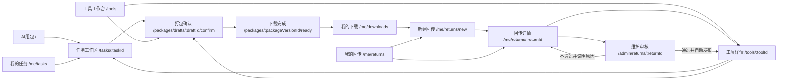

# AI 工具工作台：前端路由与状态基线

- 文档状态：前端 MVP 实现基线
- 基线版本：v0.1.0
- 整理日期：2026-07-24
- 代码依据：`apps/web/src/app`、`apps/web/src/features`、`apps/web/src/lib/workbench-store.tsx`
- 视觉依据：`design/selected`

## 一、用途

本文记录当前代码已经实现的页面路径、页面状态、访问边界和代码归属。

产品方案描述“为什么这样设计”，视觉稿描述“页面应当长什么样”，本文只回答以下问题：

1. 当前真实 URL 是什么；
2. URL 对应哪个页面或页面状态；
3. 页面是否需要登录；
4. 页面数据目前来自哪里；
5. 未来接入真实接口时应替换哪一层。

本文是前后端联调时的页面事实基线。若代码路径发生变化，必须同步更新本文和自动链路检查。

## 二、一级导航

| 导航名称 | 正式路径 | 未登录可见 | 说明 |
|---|---|---:|---|
| AI组包 | `/` | 是 | 平台默认首页，输入需求并创建任务 |
| 工具 | `/tools` | 是 | 浏览、搜索、筛选、下载和手动组包 |
| 我的任务 | `/me/tasks` | 否 | 查看并恢复历史任务 |
| 我的下载 | `/me/downloads` | 否 | 查看不可变下载记录和来源 |
| 我的回传 | `/me/returns` | 否 | 查看回传状态和已发布贡献 |

生产规范 `/standards` 位于账户菜单和回传修正入口，不占用一级导航。

`/` 是唯一正式 AI 首页。项目不再使用 `/ai` 作为正式路径。

## 三、正式页面路径

| 页面编号 | 页面或对象 | 正式路径 | 访问范围 | 页面实现 |
|---|---|---|---|---|
| U01 | AI 组包首页 | `/` | 游客可浏览，发送需求时登录 | `features/ai-packaging/home` |
| U01 | 任务工作区 | `/tasks/:taskId` | 登录用户 | `features/ai-packaging/task-workspace` |
| U02 | 工具工作台 | `/tools` | 游客可浏览 | `features/tools/tool-pages.tsx` |
| U03 | 工具详情 | `/tools/:toolId` | 游客可浏览，下载等动作时登录 | `features/tools/tool-pages.tsx` |
| U04 | 打包确认 | `/packages/drafts/:draftId/confirm` | 登录用户 | `features/packages/package-pages.tsx` |
| U05 | 下载完成 | `/packages/:packageVersionId/ready` | 登录用户 | `features/packages/package-pages.tsx` |
| U06 | 我的任务 | `/me/tasks` | 登录用户 | `features/me/personal-pages.tsx` |
| U07 | 我的下载 | `/me/downloads` | 登录用户 | `features/me/personal-pages.tsx` |
| U08 | 我的回传 | `/me/returns` | 登录用户 | `features/me/personal-pages.tsx` |
| U09 | 新建/修正回传 | `/me/returns/new` | 登录用户 | `features/me/personal-pages.tsx` |
| U10 | 回传详情 | `/me/returns/:returnId` | 登录用户 | `features/me/personal-pages.tsx` |
| U11 | 生产规范与模板 | `/standards` | 游客可浏览 | `features/standards/standards-page.tsx` |
| A01 | 今日工作 | `/admin` | 维护人员、管理员 | `features/admin/overview-page.tsx` |
| A02 | 工具目录 | `/admin/tools` | 维护人员、管理员 | `features/admin/tool-management-pages.tsx` |
| A03 | 工具详情 | `/admin/tools/:slug` | 维护人员、管理员 | `features/admin/tool-management-pages.tsx` |
| A04 | 上传新工具 | `/admin/tools/upload` | 维护人员、管理员 | `features/admin/maintenance-pages.tsx` |
| A05 | 工具版本 | `/admin/versions` | 维护人员、管理员 | `features/admin/maintenance-pages.tsx` |
| A06 | 回传审核 | `/admin/returns`、`/admin/returns/:returnId` | 维护人员、管理员 | `features/admin/return-review-pages.tsx` |
| A07 | 发布管理 | `/admin/publishing` | 维护人员、管理员 | `features/admin/maintenance-pages.tsx` |
| A08 | 标签与分类 | `/admin/taxonomy` | 维护人员、管理员 | `features/admin/maintenance-pages.tsx` |
| A09 | 内容生产与编辑 | `/admin/content`、`/admin/content/:contentId` | 维护人员、管理员 | `features/admin/maintenance-pages.tsx` |
| A10 | 内容审核 | `/admin/content/review` | 维护人员、管理员 | `features/admin/maintenance-pages.tsx` |
| A11 | 内容结构 | `/admin/content/structure` | 维护人员、管理员 | `features/admin/maintenance-pages.tsx` |
| A12 | AI 服务 | `/admin/ai` | 维护人员、管理员 | `features/admin/content-ai-pages.tsx` |
| A13 | AI 评测与监控 | `/admin/ai/evaluation` | 维护人员、管理员 | `features/admin/maintenance-pages.tsx` |
| A14 | Prompt 管理与编辑 | `/admin/ai/prompts`、`/admin/ai/prompts/:promptId` | 维护人员、管理员 | `features/admin/maintenance-pages.tsx` |
| A15 | 用户管理 | `/admin/users` | 管理员 | `features/admin/organization-operations-pages.tsx` |
| A16 | 角色权限 | `/admin/roles` | 管理员 | `features/admin/maintenance-pages.tsx` |
| A17 | 团队管理 | `/admin/teams` | 管理员 | `features/admin/maintenance-pages.tsx` |
| A18 | 数据看板 | `/admin/analytics` | 维护人员、管理员 | `features/admin/maintenance-pages.tsx` |
| A19 | 平台行为分析 | `/admin/behavior` | 维护人员、管理员 | `features/admin/maintenance-pages.tsx` |
| A20 | 操作日志 | `/admin/audit`、`/admin/audit/:logId` | 管理员 | `features/admin/maintenance-pages.tsx` |
| A21 | 变更记录 | `/admin/changes`、`/admin/changes/:changeId` | 管理员 | `features/admin/maintenance-pages.tsx` |
| A22 | 系统设置 | `/admin/settings` | 管理员 | `features/admin/maintenance-pages.tsx` |

## 四、任务工作区状态

任务工作区是同一个任务对象的连续状态，不是多个一级页面。

| 状态 | URL | 默认进入条件 | 主要下一步 |
|---|---|---|---|
| 快速确认 | `/tasks/:taskId` | 新需求基本清楚 | 任务说明确认或深入对话 |
| 深入对话 | `/tasks/:taskId?mode=deep` | 需求较模糊或用户主动补充 | 任务说明确认 |
| 任务说明确认 | `/tasks/:taskId?mode=brief` | AI 已形成结构化理解 | 查看推荐方案 |
| 默认主推荐 | `/tasks/:taskId?mode=recommend` | 任务说明已确认 | 打包确认 |
| 备选比较 | `/tasks/:taskId?mode=compare` | 用户要求比较其他方案 | 选择方案并打包 |
| 能力缺口 | `/tasks/:taskId?mode=gap` | 现有工具不能完全覆盖需求 | 生成待生产组件说明并打包 |

UUID 任务以 API 返回的 `phase` 为事实来源，`mode` 只在允许的阶段切换对话、任务说明和推荐视图；旧演示任务仍按 `mode` 展示静态走查状态。

## 五、流程参数

| 页面 | 参数 | 作用 |
|---|---|---|
| 工具详情 | `toolId` | 定位工具逻辑身份 |
| 任务工作区 | `taskId` | 定位需求任务 |
| 任务工作区 | `mode` | 当前前端演示的任务视图 |
| 打包确认 | `draftId` | 定位 AI 或手动工具包草稿 |
| 下载完成 | `packageVersionId` | 定位已生成的不可变包版本 |
| 新建回传 | `download` | 自动带入回传来源下载凭证 |
| 回传详情 | `returnId` | 定位一次回传提交 |
| 回传审核详情 | `returnId` | 定位维护人员权限范围内的一次回传 |

## 六、兼容跳转

以下路径只用于兼容早期页面名称，不应再出现在新功能链接中：

| 兼容路径 | 自动跳转 |
|---|---|
| `/home` | `/` |
| `/tasks` | `/me/tasks` |
| `/downloads` | `/me/downloads` |
| `/returns` | `/me/returns` |

## 七、核心页面链路

## 八、状态归属

### 8.1 URL 状态

URL 保存可定位和可恢复的信息：

- 工具、任务、草稿、包版本和回传 ID；
- 任务工作区当前模式；
- 新建回传的来源下载 ID。

### 8.2 跨页面状态

`apps/web/src/lib/workbench-store.tsx` 当前保存：

- API 返回的当前登录用户；
- 任务索引及本地打包阶段；
- 当前工具包草稿；
- 下载记录；
- 回传记录；
- 登录后继续执行的待恢复动作。

状态以 `schemaVersion: 6` 按用户 ID 隔离写入浏览器 `localStorage`。登录事实每次启动时由 `/v1/me` 重新确认；退出登录会立即清空当前页面中的用户状态。AI 原始消息、任务说明、推荐、上下文版本、任务列表、工具包草稿、工具包版本、下载凭证和回传记录保存在服务端数据库。手动组包的部分临时交互仍是前端阶段性状态。

### 8.3 API 与 Mock 数据

以下链路已经使用真实 API：

- 登录、注销和当前用户；
- AI 任务创建、补充、确认、推荐和单任务历史恢复。
- 本人任务列表；
- AI工具包草稿创建、自动保存和直达恢复。
- 不可变工具包版本生成、鉴权下载和历史下载凭证；
- 回传 ZIP 上传、自动预检查、重新上传、提交审核和历史版本下载。
- 维护人员审核队列、回传详情、通过/不通过和发布后工具目录读取。

`apps/web/src/lib/api/mock-repository.ts` 只继续提供尚未接入后端的少量展示和手动组包演示数据，不再作为下载与回传事实来源。

### 8.4 组件本地状态

搜索文字、筛选项、弹层开关、当前页签和临时文件名等只属于当前页面，不写入全局状态。

## 九、当前未实现范围

以下能力仍需后端或公司基础设施接入；对应维护前端页面已建立：

- 公司统一登录；
- 公司内部真实模型；DeepSeek脱敏开发适配已实现，但默认未启用；
- 正式对象存储和病毒引擎；
- 当前已完成浏览器分片续传与持久化异步预检；接入公司对象存储后复用同一上传会话和任务接口；
- 一键唤起本地 Agent。

维护后台现已拥有正式路由、选定视觉稿和前端代码；其中演示型配置动作会在页面内给出明确反馈，不能视为后端数据已经永久保存。

## 十、变更规则

新增或调整页面时必须同时完成：

1. 在 `src/app` 中建立或修改路由入口；
2. 在对应 `features` 模块实现业务页面；
3. 更新本文、MVP 页面清单和视觉稿索引；
4. 更新 `tests/e2e` 中的页面与跳转检查；
5. 通过 `typecheck`、`lint`、`test:e2e` 和 `build`。
