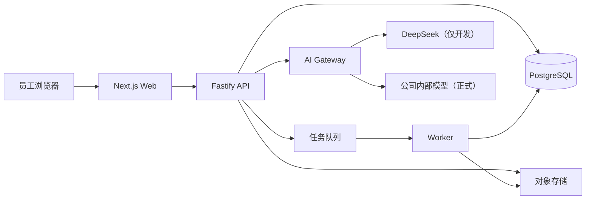

# AI 工具工作台：后端技术架构基线

- 文档状态：首期开发基线
- 基线版本：v0.2
- 整理日期：2026-07-23
- 规模依据：约 100 名内部员工，20–30 人同时使用，文件可能超过数 GB

## 一、目标

后端首期以“简单部署、边界清楚、以后可替换”为原则：

- 公司内网运行；
- 不引入微服务集群；
- 支持大文件和异步检查；
- 开发期使用 DeepSeek，正式环境切换公司内部模型；
- 不改变已经完成的用户侧页面路径；
- 不把平台扩展成在线工具执行和修改环境。

## 二、确定的技术基线

| 能力 | 首期选择 | 原因 |
|---|---|---|
| 运行语言 | Node.js + TypeScript | 与现有前端和共享契约一致 |
| API 服务 | 独立 Fastify 应用 | 轻量、边界清楚，不把大文件和后台任务塞进 Next.js |
| 数据库 | PostgreSQL | 支持关系、事务、审计和版本关系 |
| 数据校验 | Zod Schema | 运行时校验并与 TypeScript 类型协同 |
| 文件存储 | S3 兼容存储接口 | 开发可用本地适配，内网可切换 MinIO 或公司存储 |
| 异步任务 | PostgreSQL 支撑的任务队列 | 百人规模不额外引入 Redis |
| AI 接入 | 独立 AI Gateway | DeepSeek 和公司内部模型共用统一业务接口 |
| 部署 | Docker Compose | 一台内网 Linux 服务器即可运行和迁移 |
| 反向代理 | 公司现有网关或轻量反向代理 | 统一 HTTPS、上传入口和访问日志 |

首期明确不使用 Kubernetes、分布式数据库、多套外部模型适配和独立搜索集群。

## 三、代码结构

开始后端编码时新增以下实际目录：

```text
AI工具工作台设计/
├── apps/
│   ├── web/                         # 已完成的 Next.js 用户侧前端
│   ├── api/                         # 身份、工具、任务、工具包、下载、回传 API
│   └── worker/                      # 打包、解压、自动检查、索引和清理任务
├── packages/
│   ├── contracts/                   # 请求、响应和业务 Schema
│   ├── config/                      # 共享 TypeScript 配置
│   ├── db/                          # 数据库 Schema、迁移和查询
│   ├── ai/                          # AI Gateway、提示词模板和 Provider
│   └── storage/                     # 本地与 S3 兼容文件存储适配
└── deploy/
    └── compose/                     # 内网单机部署配置
```

`packages/ai` 已落地可运行的 Mock Provider、Prompt注册、约束、上下文压缩、工具候选排序和推荐编排。DeepSeek开发适配已经实现，但默认不启用，仅允许非生产环境使用脱敏样例；公司内部模型适配尚未实现。

## 四、运行组件



正式环境不启用 DeepSeek Provider；开发环境不使用真实员工和内部工具数据。

## 五、关键执行链路

### 5.1 普通页面请求

浏览器请求 Web，Web 调用 API，API 完成权限判断和数据库读写。页面不能直接访问数据库或对象存储。

### 5.2 AI 需求与推荐

API 保存任务和任务说明，工具索引召回可见候选，AI Gateway 调用当前 Provider，结构化校验通过后保存推荐结果。

### 5.3 工具包生成

API 创建生成任务，Worker 读取锁定工具版本、生产标准和提示词模板，生成包并写入对象存储。完成后创建不可变包版本和下载凭证。

### 5.4 大文件回传

API 创建上传会话，浏览器分片直传对象存储。完成后 Worker 校验摘要、解压结构和生产标准，再把结果写回回传记录。

### 5.5 发布

维护人员只能对通过自动检查的提交作出通过或不通过决定。通过后在一个数据库事务中创建工具、版本、衍生关系和发布记录，再异步更新工具索引。

## 六、环境隔离

| 环境 | 数据 | AI Provider | 文件存储 |
|---|---|---|---|
| 本地开发 | Mock / 脱敏数据 | Mock 或 DeepSeek | 本地目录 |
| 内网测试 | 脱敏测试数据 | DeepSeek 或内部测试模型 | 内网测试存储 |
| 内网正式 | 真实内部数据 | 公司内部模型 | 正式内网对象存储 |

生产启动检查必须阻止：

- `AI_PROVIDER=external-dev`；
- 缺失会话密钥或数据库凭证；
- 使用默认管理员密码；
- 文件存储指向开发目录；
- 调试日志记录请求正文或敏感字段。

## 七、权限角色

首期只保留三类平台角色：

- 员工：创建任务、下载、评价、回传和管理自己的记录；
- 维护人员：上传维护工具、查看授权范围内回传、通过或不通过；
- 管理员：创建/导入账号、维护部门职能、分配权限和查看系统状态。

部门和职能是业务归属，不等于平台权限角色。

## 八、实现顺序

1. 扩展共享 Schema，建立数据库迁移和 API 错误规范；
2. 完成自建账号、首次设置密码和角色权限；
3. 接入工具目录、版本、标签和衍生关系；
4. 建立 AI Gateway、DeepSeek 开发适配和工具知识索引；（已完成基础适配与目录候选检索）
5. 接入 AI 任务、任务说明和推荐结果；（已完成）
6. 完成工具包生成、版本锁定和下载凭证；
7. 完成分片上传、异步预检查和用户回传；
8. 最后开发维护人员上传与审核后台。

每个阶段替换对应 Mock 数据，避免一次性重写全部前端。

## 九、上线前必须替换

- DeepSeek 个人 Key → 公司内部模型凭证；
- 本地文件目录 → 正式内网对象存储；
- 演示登录 → 正式内部账号和密码策略；
- LocalStorage 业务状态 → API 与数据库；
- Mock 工具、任务、下载和回传 → 正式数据。
