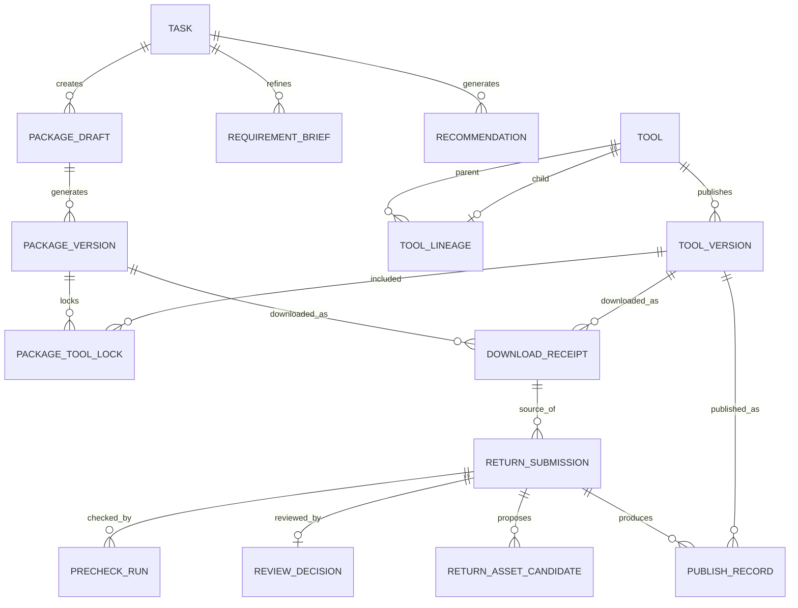

# AI 工具工作台：核心数据模型与接口边界

- 文档状态：后端设计与实现基线
- 基线版本：v0.3
- 整理日期：2026-07-27
- 产品依据：平台结构化总览、MVP 页面清单、工具生产与上传标准

## 已确认决策

| 决策项 | 当前结论 | 直接影响 |
|---|---|---|
| 使用范围 | 仅限公司内部人员访问 | 不做公网注册；用户身份、部门和职能来自内部账号体系 |
| 首期登录 | 暂无统一登录，平台自建内部账号 | 不依赖企业微信、钉钉、飞书或 AD；预留未来身份绑定字段 |
| 账号开通 | 维护人员创建或批量导入，员工首次登录设置密码 | 不开放自由注册；部门、职能和平台角色由维护侧管理 |
| 部署范围 | 公司内网 | Web、API、数据库和文件存储不直接暴露公网；外部访问以后通过公司 VPN |
| 现有基础资源 | 暂不确定 | 首期采用可迁移部署，不绑定指定服务器、NAS 或云产品 |
| 首期规模 | 约 100 名员工 | 按 20–30 人同时使用预留；单节点部署即可，不引入复杂集群 |
| 文件规模 | 因工具类型而异，可能超过数 GB | 必须支持分片、断点续传、异步检查和按类型配置额度 |
| 下载历史 | 下载凭证永久保留 | 版本下架后保留记录并停止原包下载；提示更新版本和衍生版本 |
| AI 服务 | 公司已有内部大模型服务 | 平台只对接内部模型，不把需求、工具说明和回传内容发送到外部模型 |
| 开发期 AI | 使用个人 DeepSeek API | 仅允许脱敏 Mock 数据；正式环境禁止启用，后续切换公司内部模型 |
| 下载历史 | 永久保留记录 | 下载凭证采用不可变事实；文件本体保存期限单独决定 |
| 工具执行位置 | 用户自己的本地 Agent | 平台不在线运行或修改工具 |
| 工具包兼容性 | 通用 Agent 工具包 | 不绑定 Codex、Claude、Hermes、OpenClaw、Trae 或 Qoder |
| 回传前处理 | 自动检查，不通过则返回本地 Agent 修正 | 平台不承担在线整理和修改 |
| 首期人工审核 | 通过 / 不通过 | 通过后自动发布并成为默认最新版本 |

## 一、先确定的核心边界

平台负责理解需求、推荐和组合工具、生成规范化工具包、记录下载来源、接收回传、自动检查和审核发布。

平台首期不负责：

- 面向外部人员开放注册和使用；
- 在线运行用户工具；
- 在线修改用户下载的工具；
- 替用户调试本地 Agent；
- 自动把未通过检查的回传整理成合格工具；
- 一键唤起 Codex、Claude、Hermes、OpenClaw、Trae 或 Qoder。

用户在本地 Agent 中执行和调整。平台通过随包规则约束 Agent 的修改边界，并通过下载凭证、版本锁定和回传来源恢复完整关系。

## 二、最重要的概念区分

### 2.1 工具

`Tool` 是平台工具库中的一个长期逻辑身份，可以是：

- 单一组件工具；
- 衍生工具；
- 组合工具；
- 模板或知识型工具。

工具本身不保存可下载文件的变化内容，具体文件属于 `ToolVersion`。

### 2.2 工具版本

`ToolVersion` 是一次不可变发布。任何已被下载或被其他工具引用的版本都不能覆盖，只能创建新版本。

版本包含：

- 下载文件；
- 清单和 README；
- 生产标准版本；
- 能力、环境与风险说明；
- 验证状态；
- 发布时间和发布人。

### 2.3 工具包草稿与工具包版本

用户在平台选出的多个工具和目标首先形成 `PackageDraft`，确认并生成后形成不可变的 `PackageVersion`。

工具包版本不是工具库资产。只有用户本地调整后回传，并通过自动检查和人工审核，才可能沉淀为新的组合工具或衍生工具。

### 2.4 回传提交与发布资产

`ReturnSubmission` 是用户上传的一次候选提交，不等于已经发布的工具。

审核通过后，一次提交可以形成：

1. 一个完整的组合工具；
2. 零到多个既有主工具的衍生工具；
3. 零到多个可以独立复用的新工具。

平台 AI 可以提出拆解建议，最终发布关系由审核结果确认。

## 三、核心实体

| 实体 | 作用 | 首期关键字段 |
|---|---|---|
| `Organization` | 用户所属组织 | id、name、status |
| `User` | 平台用户 | id、name、organizationId、role |
| `Tool` | 工具逻辑身份 | id、name、kind、module、category、status、latestVersionId |
| `ToolVersion` | 不可变工具版本 | id、toolId、version、artifactId、manifest、verification、releasedAt |
| `ToolLineage` | 主工具和衍生工具关系 | childToolId、parentToolId、parentVersionId、difference |
| `Task` | 用户的一次需求任务 | id、userId、goal、stage、currentBriefId |
| `RequirementBrief` | AI 对需求的结构化理解 | input、goal、deliverables、constraints、assumptions、confirmedAt |
| `Recommendation` | AI 选包结果 | taskId、primaryOption、alternatives、gaps、explanation |
| `PackageDraft` | AI 或手动组包草稿 | id、taskId、source、goal、selectedTools、plannedComponents |
| `PackageVersion` | 可下载的不可变工具包 | id、draftId、version、artifactId、startPrompt、standardVersion |
| `PackageToolLock` | 工具包中的版本锁定 | packageVersionId、toolId、toolVersionId、purpose、replaceable |
| `DownloadReceipt` | 一次不可变下载凭证 | id、userId、objectType、objectVersionId、downloadedAt |
| `ReturnSubmission` | 用户回传候选版本 | id、uploaderId、sourceDownloadId、version、state、artifactId |
| `ReturnAssetCandidate` | AI 建议从回传中形成的资产 | submissionId、type、sourceToolId、name、reason |
| `PrecheckRun` | 自动检查结果 | submissionId、standardVersion、status、findings |
| `ReviewDecision` | 维护人员通过或不通过 | submissionId、reviewerId、decision、reason、decidedAt |
| `PublishRecord` | 审核后形成的发布事实 | submissionId、toolId、toolVersionId、publishedAt |
| `FileArtifact` | 文件或文件包的统一引用 | id、storageKey、size、checksum、mediaType、status |
| `UploadSession` | 大文件分片上传会话 | id、userId、purpose、expectedSize、uploadedParts、expiresAt |

### 3.1 当前已落库范围

截至 2026-07-27，`Organization`、`User`、`Tool`、`ToolVersion`、`ToolLineage`、`ToolAssetEvent`、AI任务记忆、`PackageDraft`、不可变工具包版本、下载凭证、回传版本、审核决定和发布记录已经通过 PostgreSQL 迁移实现。

当前`PackageDraft`保存目标、交付物、选中工具、能力缺口和分段确认进度，并按用户隔离。`PackageVersion`锁定工具版本并生成真实 ZIP；下载凭证、回传来源、回传版本、自动检查与人工审核均已持久化。

工具目录还包含两个辅助事实：

- `ToolModulePlacement`：一个工具可以展示在多个模块，并且只有一个主模块；
- `ToolAdoptionEvent`：记录下载、使用反馈或评价发生时的用户、部门和职能，目录中的“被哪些部门/职能采用”不依赖维护人员手填。

`ToolMetrics` 是查询聚合结果，不代替采用事件。正式写入下载和评价时，应先记录事实事件，再更新聚合值。

`ToolAssetEvent` 是单个工具资产的生命周期时间线，记录创建、资料修改、版本创建、版本发布和下架；平台级安全审计仍使用独立 `AuditEvent`。维护上传和用户回传通过不同来源字段进入同一工具资产模型。

## 四、核心关系



## 五、工具、版本与衍生关系规则

1. `Tool.id` 表示长期身份，`ToolVersion.id` 表示一次具体内容。
2. 默认下载 `Tool.latestVersionId`，用户可以主动选择历史版本或分支版本。
3. 已发布版本不可覆盖、不可原地修改。
4. 新版本通过后自动成为默认最新版本。
5. 用户可以将旧版本设为上架或下架，但下架不删除下载凭证和来源关系。
6. 衍生工具必须记录父工具和具体父版本，不能只记录父工具名称。
7. 衍生工具拥有独立版本线；父工具升级不会自动修改衍生工具。
8. 组合工具通过 `PackageToolLock` 固定内部组件版本。
9. 一次回传可以同时生成组合工具和多个衍生工具，但每个发布资产拥有独立 `Tool` 与 `ToolVersion`。
10. 下载、回传、审核和发布记录采用追加事实，不通过覆盖旧记录表达状态变化。

### 5.1 下载记录与版本提示

“我的下载”按照不可变事实处理：

- `DownloadReceipt` 永久保留，不因工具、版本或用户行为删除；
- 记录始终显示用户当时下载的准确工具版本或工具包版本；
- 当前版本仍上架时，允许重新下载原版本；
- 当前版本下架时，保留记录但禁用原包下载，并明确显示“该版本已下架”；
- 存在更新版本时，显示最新可用版本、发布时间和查看入口；
- 存在衍生版本时，显示衍生工具数量及入口；
- 更新版本和衍生版本仅作为提示，不自动替换原下载版本；
- 下架原因、更新提示和衍生提示在查询时根据当前工具状态计算，不覆盖历史下载凭证；
- 如果下架源于安全或合规问题，引用该版本的历史组合包也要停止重新下载并显示原因。

后端为下载页面提供聚合状态：

```text
DownloadAvailability
├── receipt                         # 永久历史事实
├── exactVersionAvailable           # 原版本当前能否重下
├── unavailableReason               # 下架或安全限制原因
├── latestAvailableVersion          # 可选更新版本
└── derivedOptions[]                # 可选衍生版本
```
11. 下载凭证永久保留；即使关联版本下架或文件本体按策略归档，也不能删除来源关系。

## 六、回传状态

首期状态建议与当前共享契约保持一致：

```text
prechecking
    ├── precheck-failed → 用户下载缺失项与修正提示 → 本地 Agent 修正 → 重新上传
    └── reviewing
            ├── review-rejected → 用户查看原因并上传新版本
            └── published → 自动上架并成为默认最新版本
                                  └── offline / 重新上架
```

约束：

- 自动检查未通过时，不进入维护人员队列；
- 平台只列缺失项、风险和完成标准，不在线替用户修改；
- 审核完成前，仅上传者和有权限的维护人员可查看；
- 首期人工审核只有“通过”和“不通过”；
- 发布后形成的工具与版本必须保留来源下载凭证。

## 七、后端模块边界

| 模块 | 负责内容 | 不负责内容 |
|---|---|---|
| Auth / Organization | 登录、用户、组织、角色权限 | AI 推荐 |
| Tool Catalog | 工具、版本、标签、衍生关系、上下架 | 用户本地执行 |
| Task / AI | 需求理解、任务说明、推荐、能力缺口 | 直接修改工具文件 |
| Package | 草稿确认、版本锁定、README/Prompt 生成、文件打包 | 运行包内工具 |
| Download | 不可变下载凭证、重新下载、采用统计 | 修改下载内容 |
| Return | 上传、来源绑定、回传状态和资产候选 | 人工审核决定 |
| Precheck Worker | 结构、必需文件、清单、风险和标准版本检查 | 自动修复不合格工具 |
| Review / Publish | 通过或不通过、拆解确认、发布和默认版本更新 | 用户侧在线编辑 |
| File Storage | 原始上传、生成包、校验摘要和受控下载 | 业务关系判断 |

### 7.1 内部访问约束

首期所有业务接口和文件都按内部系统处理：

- 不提供公开注册入口；
- 用户必须属于公司内部账号目录；
- 部门和职能优先从账号资料自动带出，不要求用户手填；
- 普通员工、维护人员和管理员使用不同权限；
- 工具包、回传文件和下载地址必须经过登录鉴权，不能形成永久公开链接；
- 审核完成前的回传只允许上传者和授权维护人员查看；
- Web、API、数据库和文件存储均部署在公司内网，不直接提供公网入口；
- 若以后需要在公司网络外访问，优先通过公司 VPN 或统一零信任入口，不单独开放平台端口。

### 7.2 首期自建账号

首期没有公司统一登录，账号系统按以下边界设计：

- 不开放员工自行注册；
- 账号由平台维护人员单个创建或批量导入；
- 员工首次登录必须设置自己的密码，初始凭证不能长期有效；
- 用户记录至少包含姓名、内部账号、部门、职能、状态和平台角色；
- 部门、职能和平台角色不能由普通用户随意修改；
- 密码只保存安全哈希，不记录或展示明文；
- 登录会话、失败次数、停用状态和密码重置需要独立记录；
- `User` 预留 `externalIdentityProvider` 和 `externalIdentityId`，以后接入统一登录时绑定原账号，不创建第二套用户数据；
- 下载凭证、任务、工具包和回传始终关联平台内部 `User.id`，不直接依赖登录账号字符串。

### 7.3 可迁移内网部署

在内网服务器和共享存储尚未确定前，系统按可迁移方式设计：

- Web、API、异步检查、数据库和文件存储保持清晰边界；
- 首期可以整体部署在一台内网 Linux 服务器，规模增长后再拆分；
- 业务文件通过统一存储接口读写，不在页面或业务代码中写死本机路径；
- 开发环境可以使用本地目录，正式环境可以切换到 MinIO、NAS 或其他公司存储；
- 数据库和文件分别备份，文件记录保存摘要、大小、类型和存储键；
- 部署参数通过环境变量提供，不把服务器地址、账号和密钥写入仓库；
- 推荐使用容器化部署，换服务器时迁移配置、数据库和文件卷即可。

### 7.4 百人规模基线

首期约 100 名内部员工，采用以下容量原则：

- 不引入 Kubernetes、分布式数据库或多机微服务；
- 一套 Web、一套 API、一个异步任务进程、一个 PostgreSQL 数据库和一个文件存储即可；
- Web 请求与文件检查任务分离，避免大文件检查阻塞页面操作；
- 按 20–30 人同时在线设计连接池和会话；
- 数据库先单实例运行并定时备份；
- 文件容量根据单包大小、保存期限和版本数量单独计算，不用用户人数粗略代替；
- 保留服务健康检查、任务重试和日志，便于内部维护人员定位问题。

### 7.5 大文件处理基线

工具类型不同，文件可能从几 MB 到数 GB。文件链路必须遵守：

- 数据库只保存 `FileArtifact` 元数据和存储键，不保存二进制大字段；
- 浏览器通过上传会话直接分片写入内网对象存储，不把整包读入 Web/API 内存；
- 支持暂停、失败重试和断点续传，完成后由服务端校验分片、总大小和 SHA-256；
- 上传完成只表示文件到达，不表示自动检查通过；
- 解压、目录检查、清单校验、病毒扫描和摘要生成均进入异步任务；
- 检查过程使用流式读取和受限临时空间，必须防止压缩炸弹和路径穿越；
- 不设置一个过小的全平台固定上限，按工具类别、用户角色和存储容量配置额度；
- 上传前显示预计大小和剩余空间，超出额度时在传输前阻止；
- 对未完成上传设置过期时间，自动清理遗留分片；
- 下载同样支持 Range 请求和断点续传；
- 正式环境优先使用内网 S3 兼容对象存储（如 MinIO），NAS 通过存储适配层接入，不在业务代码中写死。

### 7.6 文件保存策略

- 下载凭证、审核记录、发布记录和文件元数据永久保留；
- 上架中的工具版本和工具包版本保留原始文件，支持原版本重新下载；
- 下架版本保留元数据、校验摘要和历史关系，用户侧停止下载原文件；
- 未完成上传的分片默认 7 天后清理；
- 自动检查未通过或人工审核未通过的候选文件默认保留 30 天，上传者可在期限内查看并重新提交；
- 具体期限作为维护配置，不写死在业务代码中；
- 文件物理删除必须在元数据标记、引用检查和审计记录完成后异步执行。

### 7.7 内部大模型接入

平台通过独立 `AI Gateway` 对接公司内部大模型服务：

- 业务模块不直接调用具体模型地址；
- `AI Gateway` 统一处理鉴权、超时、重试、流式输出、错误转换和调用审计；
- 模型名称、服务地址和凭证来自环境配置，不写入仓库；
- 需求理解、任务说明、工具推荐、能力缺口、生产提示词和回传拆解使用不同的提示词模板；
- 提示词模板有版本号，任务和推荐结果记录所用模板版本；
- 模型输出必须经过结构化 Schema 校验，不能把自由文本直接写入核心业务字段；
- 模型只能推荐当前用户有权查看且处于上架状态的工具版本；
- 审核中、已下架或仅维护人员可见的工具不能进入普通用户推荐结果；
- AI 生成建议不直接发布工具、不直接通过审核，也不修改原始工具文件；
- 调用日志记录任务 ID、模板版本、模型标识、耗时和结果状态，不记录密钥。

公司模型接口暂时不可用时，开发环境允许临时接入个人外部 API，但必须满足：

- `AI_PROVIDER` 明确区分 `mock`、`external-dev` 和 `internal`；
- 生产环境启动时如果配置为 `external-dev` 必须直接失败，不能静默调用外部模型；
- 个人 API Key 只存在于服务端 `.env.local` 或密钥管理中，不进入浏览器、不写入仓库、不记录到日志；
- 不在聊天、需求文档、截图或提交记录中传递真实 Key；
- 外部开发模型只接收虚构或脱敏测试需求、公开示例工具和 Mock 回传数据；
- 真实员工需求、内部工具清单、未发布版本和回传文件禁止发送；
- 配置调用额度、并发限制、超时和每日成本上限；
- 业务层只依赖统一 AI 接口，切换公司内部模型时不修改任务、推荐和回传逻辑；
- 正式上线条件之一是完成内部模型联调并关闭外部开发 Provider。

开发期首个 `external-dev` Provider 确定为 DeepSeek。首期只实现这一种外部测试适配，不同时接入多家模型；模型名称、地址和 Key 均通过环境配置提供。

### 7.8 AI 如何理解工具库

首期不需要重新训练模型，而是建立平台自己的工具知识索引：

1. 工具或新版本发布后，读取已审核的 `tool-manifest`、README、标签、能力、输入输出、环境和风险；
2. 将结构化字段和说明文本生成可检索索引；
3. 用户描述需求后，先按模块、标签、能力、环境和权限召回候选工具；
4. 再由内部大模型结合任务说明，对候选工具排序、解释和组合；
5. 推荐结果必须保存候选来源、锁定版本、每个工具的作用和未覆盖能力；
6. 下载采用量和评价可以作为辅助信号，但不能覆盖能力、风险和权限约束。

这样“AI 理解所有工具”依赖审核后的平台资料和检索，不依赖模型凭记忆猜测工具能力。
- 文件元数据与下载凭证分离，清理、归档或迁移文件不能删除历史记录。

## 八、首批接口分组

这里先确定职责，不锁定 REST、RPC 或 GraphQL 形式。

### 8.1 工具目录

- 查询工具、标签、模块和分类；
- 查询工具详情、版本和衍生关系；
- 获取某个可下载版本的受控下载地址。

### 8.2 AI 任务

- 创建需求任务；
- 提交澄清回答或补充说明；
- 保存和确认任务说明；
- 生成主推荐、备选方案和能力缺口。
- 记录提示词模板版本、模型标识和候选工具来源。

### 8.3 工具包

- 创建 AI/手动草稿；
- 锁定工具版本；
- 确认目标、交付物和待生产组件；
- 生成不可变包版本；
- 查询生成状态和下载信息。

### 8.4 下载

- 创建下载凭证；
- 查询“我的下载”；
- 按原始版本重新下载；
- 提交使用评价。

### 8.5 回传

- 基于下载凭证创建回传；
- 创建分片上传会话、续传并完成上传；
- 提交文件大小、类型和校验摘要；
- 查询自动检查结果；
- 重新上传新版本；
- 提交人工审核；
- 查询“我的回传”和发布资产。

### 8.6 维护审核

- 查询待审核回传；
- 查看自动检查和来源关系；
- 确认资产拆解；
- 通过或不通过；
- 管理已发布版本上下架。

## 九、与当前前端契约的关系

`packages/contracts/src/index.ts` 已包含第一批可复用字段：

- `Tool`、`ToolVersion`；
- `Task`；
- `PackageDraft`、`PackageVersion`；
- `DownloadRecord`；
- `ReturnSubmission`、`CheckFinding`、`ReturnEvent`。

后端设计阶段不直接推翻这些类型，而是按以下顺序扩展：

1. 将展示聚合对象和数据库实体区分；
2. 补充组织、用户、权限和文件引用；
3. 将自动检查、人工审核和发布事实拆成独立结构；
4. 给所有可变资源增加版本与并发控制；
5. 再确定 API 请求和响应 Schema。

## 十、下一步需要确认的技术决策

进入后端编码前，只需要先确认：

1. 内部账号由谁创建，以及是否需要批量导入；
2. 内部大模型接口文档、鉴权方式和可用能力；
3. 正式文件存储落在哪一类公司资源；
4. 自动检查任务的超时、重试和并发限制。

这些决策不改变本文的业务实体关系。
