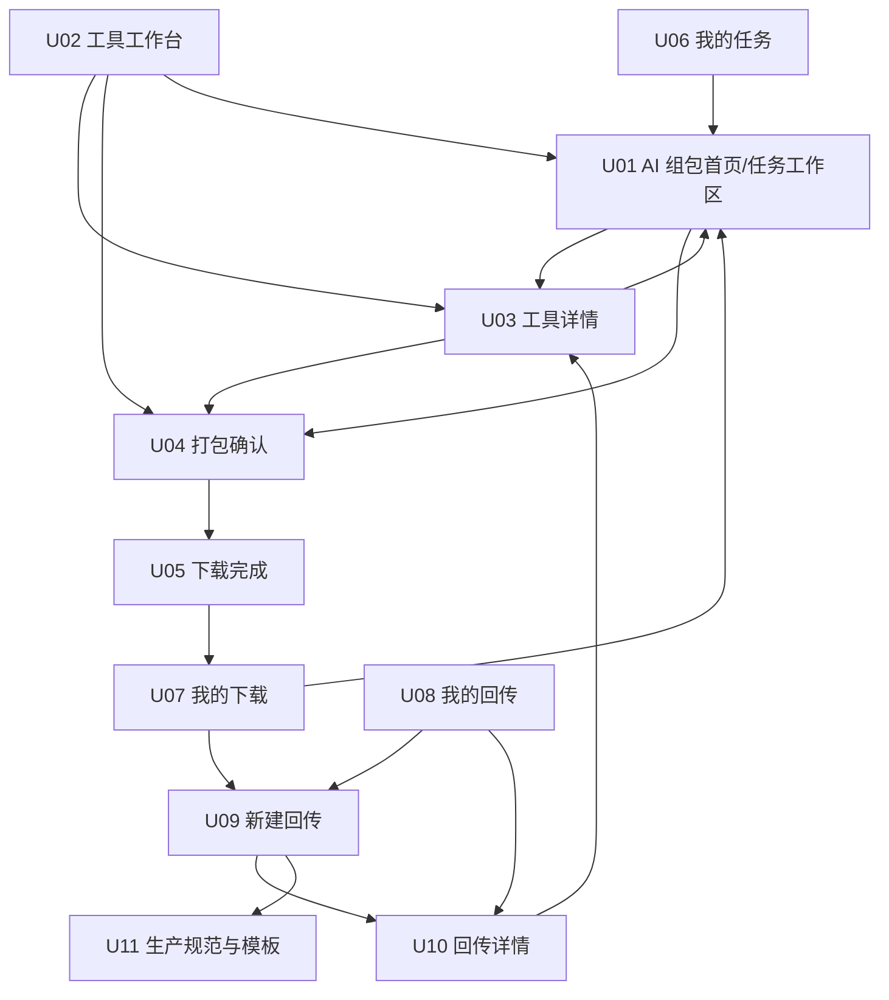
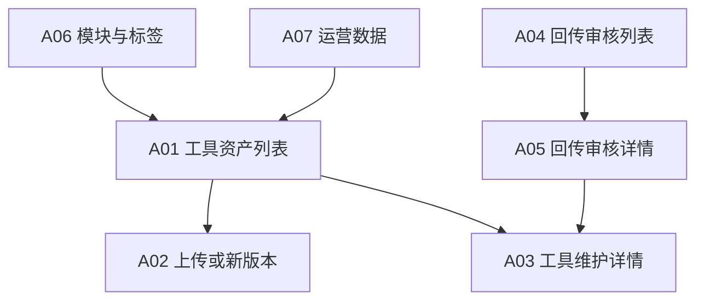
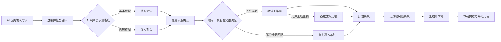
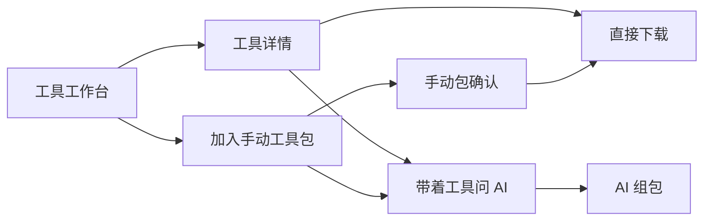
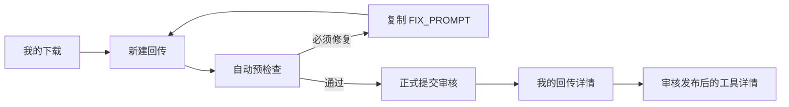

# AI 工具工作台：MVP 页面清单与跳转关系

- 文档状态：第一版页面信息架构
- 整理日期：2026-07-21
- 当前版本：v2.5
- 上级文档：[AI工具工作台-平台结构化总览](./AI工具工作台-平台结构化总览.md)
- 已选视觉方向：第二轮方案 3“项目画布工作台”
- 视觉参考：开发过程截图未纳入公开仓库，以当前实现页面为准。

## 一、页面设计原则

第一版页面结构围绕一个统一工作台外壳、两个主入口、一套个人工作区和一个维护后台展开。

页面拆分遵循以下原则：

1. 一个独立页面只承载一个明确的用户目标；
2. 登录、风险确认、评价、版本选择等短操作不单独建页面；
3. AI 新任务和历史任务共用同一任务工作区；工作区根据任务状态切换交互形态，不把所有内容堆在同一个固定仪表盘中；
4. 工具版本、衍生关系和评价放在工具详情的页签中；
5. 手动组包清单作为全局侧栏或抽屉，不建立重型工作流画布；
6. 上传、预检查和修正属于同一条回传流程，不拆成多个孤立页面；
7. 维护后台优先按工作对象划分，不按内部技术服务划分菜单。

## 二、已选工作台外壳与全局导航

### 2.0 工作台外壳

第二轮视觉方案 3 确定为用户侧基础方向。它定义的不是单独一张首页，而是所有用户侧页面共享的产品外壳：

- 左侧窄导航栏长期存在；
- 中间为当前一级模块的主内容；
- 右上角显示组织与个人入口；
- AI 组包首页使用“大需求输入框＋最近任务”结构；
- 进入具体任务、工具或回传后，仍保留同一外壳，只替换中间内容；
- 打包确认、下载完成和回传上传属于流程页，可以弱化导航，但不建立另一套视觉系统。

首页中的“AI 帮我选 / 我自己选”是两个主入口的快捷切换：

- AI 帮我选：停留在 AI 组包首页；
- 我自己选：进入工具工作台；
- 它不是在同一个页面同时展开 AI 对话和工具市场。

### 2.1 未登录状态

左侧主导航只显示：

- AI 组包；
- 工具工作台；

生产规范与模板放在侧栏底部的帮助或资源入口，不与两个核心入口争抢层级。登录入口位于右上角。

未登录用户可以浏览和填写需求，但发送 AI 消息、加入工具包、下载、评价和回传时才触发登录。

### 2.2 登录状态

左侧主导航：

- AI 组包；
- 工具工作台；
- 我的任务；
- 我的下载；
- 我的回传。

当前手动工具包作为工具工作台中的持久侧栏或抽屉，不占用一级导航。用户头像和组织信息位于右上角。具有维护权限的用户在头像菜单或侧栏底部看到“维护后台”入口。

### 2.3 全局保留状态

以下状态在页面切换时不能丢失：

- 当前 AI 任务；
- 用户已选工具及版本；
- 手动组包目标；
- 工具工作台的搜索、筛选和滚动位置；
- 游客登录前准备执行的动作；
- 打包确认页中用户手动修改的内容。

### 2.4 页面层级关系

页面不按 11 个并列入口理解，而分成四层：

#### 一级模块

长期出现在左侧导航：

1. AI 组包；
2. 工具工作台；
3. 我的任务；
4. 我的下载；
5. 我的回传。

#### 二级对象页

从一级模块中的某个对象进入：

- 任务工作区；
- 工具详情；
- 回传详情。

它们保留左侧工作台导航，并提供返回所属一级模块的路径。

#### 流程页

用于完成一段连续操作：

- 打包确认；
- 下载完成；
- 新建回传与自动预检查。

流程页不是一级导航入口。用户完成或取消后回到来源任务、工具或个人工作区。

#### 弹层与抽屉

- 登录；
- 手动工具包；
- 版本选择；
- 高影响风险确认；
- 工具评价；
- 任务结果反馈；
- 下载详情。

这些短操作不改变一级页面层级。

### 2.5 工作台首页与完整任务页的关系

已选方案 3 首页下方只展示少量最近任务：

- “进行中”建议展示 2 个；
- “最近完成”建议展示 3 个；
- 点击任务进入对应任务工作区；
- 点击“我的任务”进入完整任务列表；
- 首页不承担完整搜索、筛选和历史管理。

## 三、用户侧页面地图



## 四、用户侧页面清单

### U01 AI 组包页

正式路由：`/`、`/tasks/:taskId`

页面目标：首页让用户快速创建或继续任务；进入任务后，让用户通过 AI 获得清晰方案并进入打包。

该页面族包含两个状态，而不是两个一级页面：

1. **AI 组包首页** `/`：对应已选视觉方案 3，展示大型需求输入框、AI 帮我选/我自己选切换和最近任务；
2. **任务工作区** `/tasks/:taskId`：提交需求或打开历史任务后进入。需求梳理阶段根据清晰程度使用“快速确认”或“深入对话”，随后生成任务说明供用户确认，再进入主推荐与备选方案。

任务工作区不是三个互斥页面，而是同一任务的连续状态：

```text
首次描述需求
    ↓
AI 判断需求清晰程度
    ├── 基本清楚：快速确认少量关键问题
    └── 不够清楚：通过对话继续补充和修正
    ↓
AI 生成结构化任务说明
    ↓
用户检查、修改并确认
    ↓
默认主推荐；如有需要再比较备选，或展示能力缺口
```

“快速确认”和“深入对话”是两种需求梳理模式：

- 快速确认：AI 已基本理解需求，只剩少量会影响选包的问题；页面一次聚焦一个问题，用户选择、补充或交给本地 Agent 判断；
- 深入对话：需求仍有较大模糊或用户主动补充、纠正时，通过自然语言继续梳理；
- 任务说明确认：不再继续开放式追问，由 AI 把已理解内容整理为完整任务说明，用户检查输入、处理目标、最终交付、假设和待确认项；
- 两种梳理模式可以在同一任务中切换，最终统一汇入任务说明确认。

当前视觉参考：

- 快速确认模式
- 深入对话模式
- 任务说明确认

任务说明确认后，推荐阶段按三种职责明确的状态处理，而不是无条件建立三个并列页面：

- 默认推荐：优先展示一个最推荐方案，说明为什么适合、包含哪些工具、每个工具解决什么以及最终得到什么；
- 备选比较：只有存在结果差异明显的可行方案，或用户主动点击“比较其他方案”时才展开；比较最终结果和使用差异，不比较复杂技术参数；
- 能力缺口：现有工具不能完整满足需求时自动出现，逐项说明已有工具覆盖、缺少能力、随包提供的生产说明以及放弃缺口后的简化方案。

三种状态最终都进入同一个打包确认页。当前视觉参考：

- 默认主推荐
- 备选方案比较
- 能力覆盖与缺口

主要区域：

- 新需求输入区；
- 最近进行和最近完成的任务；
- 快速确认区或深入对话区；
- AI 已理解需求的可展开摘要；
- 结构化任务说明确认区；
- 默认显示的一个最推荐方案；
- 按需展开的少量备选方案比较；
- 部分匹配或无匹配时的能力覆盖与缺口说明；
- 最近任务入口。

主要动作：

- 发送需求；
- 通过快速选择或对话回答最多两轮关键澄清；
- 检查、修改并确认任务说明；
- 查看工具详情；
- 选择主方案或备选方案；
- 补充或修正需求；
- 进入打包确认；
- 开始新任务或继续历史任务。

页面状态：

- 未输入需求；
- 登录前暂存需求；
- 快速确认；
- 深入对话；
- 任务说明待确认；
- 正在推荐；
- 默认主推荐；
- 备选方案比较；
- 能力覆盖与缺口；
- 方案被用户修正；
- 从失败反馈返回继续调整；
- 无匹配工具并生成待生产组件。

关键跳转：

- 工具卡片 → U03 工具详情；
- 确认某个方案 → U04 打包确认；
- 最近任务 → 当前页面的历史任务状态；
- 首页“查看全部任务” → U06 我的任务；
- 首页“我自己选” → U02 工具工作台；
- 手动工具包“问 AI” → 当前页面并带入已选工具。

### U02 工具工作台

建议路由：`/tools`

页面目标：让用户浏览、搜索、筛选、下载和手动选择工具。

已选页面方向为“工具目录模式”。它保留模块化组织，但不把最新发布、下载采用和功能分类做成三个纵向首页区块，而是收敛为模块/分类导航和列表排序。

主要区域：

- 左侧业务模块与功能分类导航；
- 最近发布、下载采用两个排序视角；
- 名称与关键词搜索；
- 标签筛选；
- 当前筛选条件；
- 可连续浏览的工具卡片目录；
- 当前手动工具包折叠入口与抽屉。

页面规则：

- 默认先进入一个具体业务模块，也允许切换“全部工具”；
- 选择业务模块后，左侧展开该模块的功能分类和数量；
- 用户搜索后，结果优先按名称和关键词匹配程度展示；未搜索时可以切换最近发布或下载采用排序；
- 工具卡片展示名称、能解决的问题、标签、版本、验证状态、采用部门/职能和一条使用效果摘要；实现原理等完整信息进入工具详情；
- 当前工具包默认只显示数量入口，用户打开后才出现已选工具、可选组合目标和打包操作；
- AI 不自动推荐、增删或调整用户手动选择的工具。

工具卡片动作：

- 查看详情；
- 直接下载；
- 加入工具包；
- 带着该工具问 AI。

关键跳转：

- 查看详情 → U03；
- 直接下载 → 登录/风险确认 → U05；
- 手动包确认 → U04；
- 带着工具问 AI → U01。

### U03 工具详情页

建议路由：`/tools/:toolId`

页面目标：帮助用户判断工具是否适合，并选择正确版本。

已选页面方向为“使用效果优先”。首屏先展示主工具与主要衍生工具，再展示输入/输出示例、实际采用反馈和使用前判断。

首屏结构：

1. 工具名称、能解决的问题、标签、当前版本和验证状态；
2. 下载当前版本、加入工具包、带着工具问 AI；
3. 主工具与衍生工具选择区；
4. 输入示例与预计输出示例；
5. 实际采用与评价摘要；
6. 适合、谨慎使用以及联网、数据、环境和费用提醒。

衍生工具展示规则：

- 不能只藏在详情页签或文字链接中；
- 首屏直接展示主工具和 3 个代表性衍生工具，并提供查看全部衍生工具入口；
- 每个衍生工具显示适用场景、与主工具的差异、来源主工具版本、自身最新版本和采用摘要；
- 当前查看的主工具或衍生工具具有明确选中状态；
- 衍生工具是独立资产，不与主工具历史版本混排；
- 用户点击衍生工具后进入该衍生工具自己的详情页，再决定下载或加入工具包。

建议页签：

1. 概览；
2. 使用说明；
3. 版本历史；
4. 评价与采用。

“全部衍生工具”从首屏关系区进入，不依赖页签才能发现。

核心信息：

- 工具名称和一句话能力；
- 能解决和不能解决的问题；
- 标签和所属模块；
- 使用效果；
- 实现原理；
- 输入输出；
- 环境、联网、费用、数据和权限要求；
- 验证状态和关键风险；
- 采用部门与职能；
- 当前版本及其他可下载版本。

主要动作：

- 下载当前版本；
- 切换历史版本；
- 查看衍生工具；
- 加入工具包；
- 带着工具问 AI。

版本选择使用页内页签或弹层，不建立独立版本页面。

### U04 打包确认页

建议路由：`/packages/drafts/:draftId/confirm`

页面目标：让普通用户在下载前确认“要做什么、用什么、得到什么”。

“打包确认”是内部页面名称，用户侧标题建议使用“确认这个工具包”或“确认下载内容”，避免要求普通用户理解任务编译和文件结构。

该页不是推荐页的重复展示。推荐页帮助用户决定“选哪套方案”，打包确认页展示按照该方案即将生成的最终下载内容，以及本地 Agent 会收到的目标和规则。

页面默认处于阅读确认状态，按以下顺序组织：

1. **目标与交付**：用一句话展示最终目标，并列出主要交付物；
2. **包中工具**：展示工具名称、锁定版本、在本次任务中负责什么、是否可以替换；卡片顺序不代表执行顺序；
3. **Agent 将收到的任务要求**：用普通语言概括任务说明、各工具目标、验收标准、调整规则和回传规则，不直接展示完整文件树；
4. **待补齐内容**：仅在存在能力缺口时出现，说明待生产组件、Agent 需要完成什么以及验收目标；
5. **使用前提醒**：展示联网、费用、数据、权限、高影响修改和本地验证等与当前包相关的事项；
6. **确认操作**：固定显示“返回调整”和“确认并生成工具包”，只有存在高影响风险时再打开风险确认弹窗。

已选页面方向为“分段确认模式”。

页面布局：

- 左侧为四个确认分段：目标与交付、工具与版本、Agent 任务要求、使用前提醒；
- 中间一次只展开当前分段的内容，用户完成后进入下一项；
- 右侧固定显示简洁的当前工具包摘要，包括包名称、最终目标、交付内容、工具数量、能力缺口和总体确认进度；
- 提供“直接查看全部内容”，允许希望快速浏览的用户切换到完整阅读状态；
- 四个分段是下载前的信息检查，不代表本地 Agent 的执行流程，也不生成执行顺序；
- 全部分段确认后，“确认并生成工具包”才成为主要可执行动作。

主要内容：

- 最终目标；
- 已选工具与锁定版本；
- 每个工具需要解决的问题；
- 期望交付结果；
- 能力缺口和待生产组件；
- 本地 Agent 还需处理的内容；
- 关键风险；
- 下载后如何开始。

首屏不直接展示：

- ZIP 内部完整文件树；
- Schema、依赖图和技术参数；
- 工具执行顺序或连线；
- 完整生产提示词和全部 Agent 规则正文。

这些内容会真实写入下载包，用户需要时可以通过“查看详细规则”展开摘要或预览，但不影响主确认路径。

两种修改方式：

- **就地编辑**：点击某一区块的“修改”，只编辑目标、交付物、工具职责和补充说明；
- **告诉 AI 修改**：打开临时对话抽屉，用自然语言说明修改要求，由 AI 重新整理相关部分。

用户手动修改的内容优先，AI 不得静默覆盖。AI 更新方案后突出显示新增、删除和变化内容。

修改交互规则：

- 默认不把整页做成表单；
- 用户手动确认或修改的字段显示“本人已确认”，后续 AI 更新不得静默覆盖；
- AI 修改完成后只高亮发生变化的区块，并提供“接受修改 / 保留原内容”；
- 修改导致工具选择、费用、安全边界或能力缺口发生变化时，必须重新确认方案；
- 普通文字、命名或交付描述调整不要求用户重新走完整推荐流程。

手动组包进入此页时：

- 目标可以为空；
- 不强制逐个填写工具职责；
- 不自动调用 AI 补全；
- 可以直接确认并生成工具包。

关键跳转：

- 返回 AI 修改 → U01；
- 查看工具 → U03；
- 确认生成 → 风险确认弹窗 → U05。

### U05 下载完成页

建议路由：`/packages/:packageVersionId/ready`

页面目标：解决用户“下载以后不知道怎么开始”的问题。

已选页面方向为“立即开始模式”。页面不要求用户在站内逐步打勾，而是在下载完成后同时给出完整三步指引和可复制的开始用语。

主要内容：

- 下载状态和文件名称；
- 本次任务目标或工具能力；
- 工具和锁定版本摘要；
- 三步开始指引；
- 动态生成的开始用语；
- 一键复制开始用语；
- 重新下载；
- 查看下载记录和返回本次任务；
- 本次包的工具、交付物和能力缺口摘要。

三步指引：

1. 打开自己常用的本地 Agent；
2. 上传刚下载的完整 ZIP；如果本地 Agent 不支持 ZIP，则上传解压后的完整文件夹；
3. 复制开始用语并发送，等待 Agent 先说明理解和给出计划，用户确认后再执行。

页面交互规则：

- 进入页面时工具包已经生成并开始浏览器下载；下载失败或用户找不到文件时可以重新下载；
- 不要求用户选择 Agent 类型，同一份工具包和开始用语适用于支持上传文件的不同本地 Agent；
- 不提供一键唤起、一键上传或在线运行；
- “开始用语”是页面主操作，支持一键复制，并提供“这段话有什么用”的简短解释；
- 开始用语明确要求 Agent 先读取 `START_HERE.md`、`TASK.md` 和 `AGENT_INSTRUCTIONS.md`，说明理解并提交计划，等待用户确认后再执行；
- 重新下载必须返回当时已经确认和锁定的同一包版本，不自动替换为新工具版本；
- 下载完成页不立即要求评价，评价和任务结果反馈从后续下载记录进入。

关键跳转：

- 查看下载记录 → U07；
- 返回任务 → U01；
- 查看工具 → U03。

### U06 我的任务

建议路由：`/me/tasks`

页面目标：查看和继续 AI 需求任务。

已选页面方向为“项目列表模式”。首页只展示少量最近任务，本页负责完整搜索、筛选、继续和历史管理。

页面结构：

1. 顶部提供任务名称/目标搜索、新建任务和最近更新时间排序；
2. 筛选项包括全部、需要我处理、进行中、已生成工具包和已完成；
3. “需要我处理”优先展示在全部列表之前，突出任务说明待确认、工具包待确认等需要用户操作的任务；
4. “所有任务”使用可连续浏览的分组列表，展示当前阶段、最近包数量、更新时间和对应动作；
5. 点击任务直接恢复其任务工作区状态，不建立另一个只读任务详情页。

列表信息：

- 任务名称；
- 需求摘要；
- 当前阶段；
- 最近更新时间；
- 已生成的任务包数量；
- 最近一次任务结果。

阶段动作根据状态变化：

- 需求梳理中 → 继续任务；
- 任务说明待确认 → 继续确认；
- 方案已生成 → 查看方案；
- 工具包待确认 → 继续确认；
- 工具包已生成 → 重新下载或返回任务；
- 已完成 → 查看结果。

重新进入任务时恢复需求摘要、快速确认或深入对话状态、任务说明、推荐方案、打包确认状态和已生成包版本，不从第一轮重新开始。

主要动作：

- 继续对话；
- 查看历史方案；
- 查看某次确认版本；
- 重新下载历史工具包；
- 基于原任务继续调整。

任务详情不再单独建立一个只读页面，点击后直接进入 U01 的历史任务状态。

### U07 我的下载

建议路由：`/me/downloads`

页面目标：统一管理所有真实下载和后续反馈。

已选页面方向为“下载凭证时间线”。每一次实际下载形成一条独立、不可被新版覆盖的下载凭证。

页面结构：

- 顶部提供工具/工具包名称搜索、类型筛选和按时间排序；
- 左侧按今天、昨天和更早展示下载时间线；
- 每条记录显示时间、下载对象、类型、锁定版本摘要和反馈状态；
- 当前选中记录在右侧展开下载凭证；
- 右侧凭证显示下载 ID、时间、类型、关联任务或手动组合来源、包版本、所有锁定工具版本和反馈状态；
- 新版本只作为提示，不改变原下载凭证。

下载类型：

- 单工具；
- AI 组合包；
- 手动组合包；
- 历史版本；
- 衍生工具。

列表信息：

- 下载对象；
- 下载来源；
- 具体版本；
- 下载时间；
- 所属任务；
- 任务结果或工具评价状态。

主要动作：

- 查看下载详情；
- 重新下载原版本；
- 提交任务结果反馈；
- 评价单个工具；
- 继续和 AI 调整方案；
- 发起回传。

下载详情第一版使用同页右侧凭证面板，不新增独立页面。重新下载原内容会保留原凭证，并生成一条新的实际下载记录。

### U08 我的回传

建议路由：`/me/returns`

页面目标：管理本人回传形成的贡献成果，并处理需要修正或仍在审核的提交。

已选页面方向：方案 3“贡献成果优先”。

开发过程截图未纳入公开仓库，以当前实现页面为准。

页面结构：

1. **需要你处理**：只集中展示自动检查未通过、审核未通过等需要本人采取动作的回传；
2. **已发布的贡献**：作为页面主体，以贡献卡片展示该次回传形成的组合工具、衍生工具和新组件；
3. **贡献效果**：在已发布贡献卡片中展示采用人数、采用部门与职能、评价和后续衍生情况；
4. **处理中**：以紧凑列表展示自动检查中和审核中的提交，不与已发布成果争夺主视觉；
5. 页面是上传者的贡献维护工作区，不出现维护人员的通过或不通过按钮。

已发布贡献信息：

- 回传名称；
- 来源下载包；
- 当前默认最新版本与发布时间；
- 形成的组合工具、衍生工具和新组件数量；
- 下载采用人数；
- 采用部门与职能汇总；
- 使用评价和问题标签汇总；
- 被加入其他组合工具及继续衍生的情况；
- 当前上架状态。

待处理与处理中信息：

- 回传名称与来源下载包；
- 最近提交时间；
- 自动预检查状态或审核状态；
- 必须修复项摘要或不通过原因摘要；
- 预计结果时间仅在平台具备可靠规则时显示，首期不强制承诺。

主要动作：

- 新建回传；
- 查看回传详情；
- 上传新版本；
- 查看不通过原因；
- 管理本人贡献版本的上下架；
- 查看审核发布后的工具。

### U09 新建回传页

建议路由：`/me/returns/new`

页面目标：让普通用户完成上传、自动检查和修正闭环。

已选页面方向：方案 3“Agent 交接闭环”。

开发过程截图未纳入公开仓库，以当前实现页面为准。

页面采用同一路由内的三种状态，不为每一步额外建立页面：

1. **首次上传**：确认来源下载凭证，上传净化后的 `return-package.zip`，明确可以和禁止上传的内容；
2. **检查未通过**：采用“平台已检查—交给本地 Agent—修正后回来”的三段交接结构，这是页面的核心状态；
3. **检查通过**：展示通过结果、风险提醒和预计形成的资产，用户确认后才正式提交人工审核。

检查未通过状态的设计原则：

- 用“这个工具包还差几项，暂时不能提交审核”解释结果，不使用“审核未通过”；
- 平台只给出问题、完成标准和通用修正提示词，不提供在线编辑或自动修复；
- “复制给 Agent”是核心动作，同时支持下载包含检查报告和修正要求的文件；
- Codex、Claude、Hermes、OpenClaw、Trae、Qoder 等均可使用同一份修正要求，不要求用户选择具体 Agent；
- 修正后的包从同一页面重新上传并自动复查；
- 自动检查通过前，“提交审核”不可用，且不创建审核中记录。

流程状态：

1. 选择或拖入净化回传 ZIP；
2. 识别来源任务包；
3. 自动检查；
4. 展示必须修复、风险提醒和优化建议；
5. 不通过时复制或下载 `FIX_PROMPT.md`；
6. 用户在本地修正后重新上传；
7. 通过后确认提交，正式进入审核中。

自动检查未通过前，不创建正式“审核中”记录，也不进入维护人员审核列表。

关键跳转：

- 查看生产规范 → U11；
- 预检查通过并提交 → U10；
- 取消 → U08。

### U10 回传详情页

建议路由：`/me/returns/:returnId`

页面目标：查看一项回传从提交到发布的完整状态。

已选页面方向：方案 1“过程时间线”。

开发过程截图未纳入公开仓库，以当前实现页面为准。

页面结构：

1. **顶部摘要**：回传名称、当前状态、当前提交版本、来源任务、来源下载凭证、原始包版本和首提时间；
2. **过程时间线**：左侧按提交版本分组，保存上传、自动检查、进入人工审核、审核结论和发布事件；
3. **事件详情**：右侧只展示当前选中事件的结果、原因、文件、风险与后续动作，避免把所有版本内容同时展开；
4. **形成资产**：审核通过并发布的事件直接列出本次形成的组合工具、衍生工具和新工具，并提供查看工具入口；
5. **AI 拆解说明**：解释每个资产为什么被归为组合、衍生或新增，完整记录作为次级入口；
6. 自动检查未通过和人工审核未通过必须使用不同的事件名称、图标和解释。

交互规则：

- 默认选中最新事件；
- 点击历史事件只切换右侧详情，不改变当前正式状态；
- 每个提交版本及其文件、检查结果和审核结论永久保留；
- 上传新版本创建新的时间线分组，不覆盖旧版本；
- 用户页面可以上传新版本、查看已发布工具和管理本人贡献版本，但不能执行通过或不通过审核。

主要内容：

- 来源任务和下载包；
- 历次提交；
- 自动检查结果；
- AI 拆解结果；
- 预计形成的组合工具、衍生工具和新组件；
- 审核状态；
- 不通过原因；
- 审核发布后的工具链接；
- 版本上下架状态。

审核完成前只对上传者和维护人员可见。

### U11 生产规范与模板页

建议路由：`/standards`

页面目标：集中提供平台工具生产准则和可下载资料。

已选页面方向：方案 3“边读边下载”。

开发过程截图未纳入公开仓库，以当前实现页面为准。

页面结构：

1. **章节目录**：左侧按开始前先看、必须包含的文件、身份与来源、输入输出与入口、修改边界、验证与完成报告、净化回传、自动检查、常见问题和版本历史组织；
2. **标准正文**：中间阅读当前章节，正文以普通用户和本地 Agent 都能理解的方式说明最低完成要求；
3. **固定下载工具箱**：右侧始终提供通用空白模板、完整生产标准、单一执行工具示例和多组件组合工具示例的独立下载；
4. **章节问题**：正文下方关联本章常见自动检查问题及解决方向；
5. **版本提示**：明确当前标准版本和发布日期，历史版本可查看但默认下载当前版本。

模板下载规则：

- 通用空白模板为首要下载项，不要求先完成问答、选类型或阅读全部规范；
- 只提供一套通用主模板，不为每种工具形态建立互不兼容的基础模板；
- 工具主类型只影响补充字段与检查规则；
- 示例包与模板均显示适用标准版本、文件格式、更新时间和文件大小；
- 所有资料均可直接交给任意本地 Agent 使用，不要求选择 Agent；
- 标准、模板和示例分别下载，不强制打成一个大包。

主要内容：

- 当前工具生产标准；
- 标准版本历史；
- 通用空白模板；
- 单一执行工具合格示例；
- 多组件组合工具合格示例；
- 常见检查问题说明。

入口不占据主流程，可从工具工作台、回传页和维护上传页进入。

## 五、不单独建页的交互

以下内容使用弹窗、抽屉或页内状态：

| 交互 | 建议形式 | 原因 |
|---|---|---|
| 登录 | 弹窗或统一登录跳转后原路返回 | 必须恢复原动作，不形成业务页面 |
| 手动组包清单 | 全局右侧抽屉 | 用户浏览工具时持续可见 |
| 工具版本选择 | 工具详情页签或弹层 | 仍属于同一工具判断任务 |
| 高影响风险确认 | 下载前汇总弹窗 | 内容短，不需要独立页面 |
| 工具评价 | 抽屉或弹窗 | 30 秒内完成 |
| 任务结果反馈 | 抽屉或弹窗 | 只询问整体完成程度 |
| 下载详情 | 我的下载抽屉 | 主要动作是重下、反馈或回传 |
| 筛选条件 | 工具工作台侧栏/顶部面板 | 不离开搜索结果 |
| AI 方案差异 | 打包确认页内高亮 | 避免建立独立差异页面 |

## 六、维护后台页面地图



### A01 工具资产列表

建议路由：`/admin/tools`

主要功能：

- 搜索和筛选工具；
- 查看主类型、版本、模块、状态和风险；
- 新建工具；
- 查看官方、用户回传、组合和衍生工具；
- 批量配置模块或标签；
- 进入工具维护详情。

维护后台首页第一版可以直接进入此页，不必单独建设空泛仪表盘。

### A02 上传工具或新版本页

建议路由：`/admin/tools/new`、`/admin/tools/:toolId/versions/new`

主要流程：

1. 上传文件夹或 ZIP；
2. AI 静态读取；
3. 确认主类型和能力标签；
4. 查看自动检查结果；
5. 不合格时下载修正提示词并在本地整理；
6. 重新上传；
7. 确认工具名称、问题、标签、原理、输入输出、风险和展示模块；
8. 发布。

平台不在此页提供源码、目录或包内文档在线编辑器。

### A03 工具维护详情页

建议路由：`/admin/tools/:toolId`

建议页签：

- 基本资料；
- 文件与版本；
- 来源与组成关系；
- 风险与验证；
- 展示模块与标签；
- 下载、评价和任务结果；
- 发布记录。

主要动作：

- 修改平台展示资料；
- 发布新版本；
- 上架或下架；
- 开启或关闭 AI 主动推荐；
- 调整业务模块和标签；
- 查看历史版本与衍生关系。

包内文件修改必须回到本地整理，再通过 A02 上传新版本。

### A04 回传审核列表

建议路由：`/admin/returns`

主要功能：

- 查看已通过自动预检查的回传；
- 按提交时间、来源工具、回传者和状态筛选；
- 查看 AI 识别的组合、衍生和新增组件数量；
- 进入审核详情。

预检查未通过的用户上传不出现在此列表。

### A05 回传审核详情页

建议路由：`/admin/returns/:returnId`

主要内容：

- 原下载包与回传包；
- 自动预检查结论与风险；
- 完成报告、修改报告和验证状态；
- 上传者声明的组合工具、衍生工具和新工具资产清单；
- 每项资产的解决问题、使用效果、实现原理、发布文件和来源版本；
- 风险提醒；
- 来源下载凭证、锁定版本和完整事件时间线。

主要动作：

- 下载当前回传包复核；
- 本人确认通过并按资产清单自动发布；
- 不通过并填写原因。

首期不设置“退回修改”等中间审核状态。
平台不在审核页调整命名、类型、关系或包内文件；需要修改时选择“不通过”，由上传者带回本地 Agent 修正并上传新版本。

### A06 模块与标签管理页

建议路由：`/admin/content`

主要功能：

- 创建、重命名、排序和停用业务模块；
- 配置模块说明、图标和区块；
- 管理功能分类；
- 管理使用、业务和场景标签；
- 查看标签使用数量；
- 将工具配置到一个或多个模块。

模块和标签首期放在同一维护页面，不拆成多个后台菜单。

### A07 运营数据页

建议路由：`/admin/analytics`

主要内容：

- 需求开始到下载的转化；
- 任务全部或大部分完成比例；
- 工具下载与去重采用；
- 工具评价；
- 回传数量和审核通过率；
- 回传工具被再次采用的情况；
- 部门和职能聚合使用情况。

第一版只做支持运营判断的基础数据，不建设复杂自助分析平台。

## 七、三条关键跳转关系

### 7.1 AI 组包到下载



### 7.2 工具工作台到下载或 AI



### 7.3 下载到回传



## 八、页面间状态恢复规则

### 8.1 登录恢复

- AI 首页发送需求后登录：恢复原输入并自动开始任务；
- 工具下载后登录：恢复原工具和版本并继续下载流程；
- 加入工具包后登录：恢复所选工具和已有手动包；
- 登录取消：不创建下载或任务记录。

### 8.2 任务和方案恢复

- 快速确认选择、深入对话、需求摘要、任务说明和推荐方案均自动保存；
- 历史任务重新进入时恢复当前交互模式、任务说明、方案和当前阶段；
- 每次确认生成新的任务包版本；
- 已下载任务包保持不可变；
- 失败后继续调整仍归属于原任务。

### 8.3 工具工作台恢复

- 从详情返回时保留搜索词、标签和列表位置；
- 切换到 AI 后保留已选工具；
- 手动组包侧栏跨工具页面保留；
- 用户主动清空或完成下载后才清理当前手动包。

## 九、MVP 页面优先级

### P0：完成核心下载闭环

- U01 AI 组包；
- U02 工具工作台；
- U03 工具详情；
- U04 打包确认；
- U05 下载完成；
- U06 我的任务；
- U07 我的下载；
- A01 工具资产列表；
- A02 上传工具或新版本；
- A03 工具维护详情；
- A06 模块与标签管理。

### P0：完成回传闭环

- U08 我的回传；
- U09 新建回传；
- U10 回传详情；
- U11 生产规范与模板；
- A04 回传审核列表；
- A05 回传审核详情。

### P1：运营观察

- A07 运营数据；
- 更完整的评价分布；
- 更细的部门和职能分析。

这里的 P0 分为两个开发批次，但都属于完整 MVP。第一批验证“找到并下载”，第二批验证“使用后回传并沉淀”。

## 十、建议的开发页面包

为了减少多人开发时的交叉依赖，可以按以下页面包拆分：

1. **工具发现包**：U02、U03、A01、A03、A06；
2. **工具上传包**：A02、U11、自动检查公共组件；
3. **AI 任务包**：U01、U06；
4. **打包下载包**：U04、U05、U07；
5. **回传审核包**：U08、U09、U10、A04、A05；
6. **反馈数据包**：任务反馈、工具评价、A07。

共享能力包括账号组织、工具卡片、版本选择、风险提示、文件上传、状态标签和权限控制，应先定义公共组件和接口，避免各页面分别实现。
