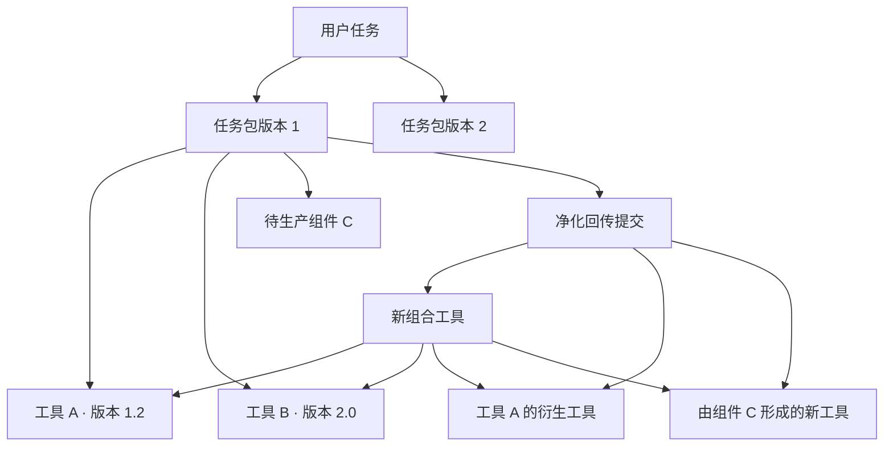

# AI 工具工作台：平台结构化总览

- 文档状态：基于现有讨论形成的第一版总体设计
- 整理日期：2026-07-21
- 当前版本：v2.5
- 详细产品依据：[AI工具工作台产品方案-讨论稿](./AI工具工作台产品方案-讨论稿.md)
- 工具规范依据：[工具生产与上传标准-讨论稿](../standards/工具生产与上传标准-讨论稿.md)
- 页面信息架构：[AI工具工作台-MVP页面清单与跳转关系](./AI工具工作台-MVP页面清单与跳转关系.md)

## 一、平台到底是什么

平台不是在线运行工具的网站，也不是工作流执行引擎，更不是在线修改工具的 IDE。

平台是一个“AI 理解需求、推荐工具、编译任务包、连接本地 Agent、沉淀新工具”的工具工作台。

它解决五件事：

1. 让不懂技术的用户说清楚自己想完成什么；
2. 从平台已有工具、组合工具和衍生工具中找到合适起点；
3. 把工具、目标、验收标准和调整规则编译成通用工具包；
4. 让用户把工具包交给自己的本地 Agent 执行、调试或继续生产；
5. 将有价值的本地调整结果回传、拆解、审核并沉淀为新的平台工具。

平台的核心闭环是：


## 二、整个平台的五层结构

### 2.1 用户体验层

负责让用户找到工具、表达需求、确认方案、下载和查看历史。

主要包括：

- AI 组包首页与自适应任务工作区；
- 工具工作台；
- 工具详情与版本页；
- 手动组包区；
- 打包确认页；
- 下载完成页；
- 我的任务；
- 我的下载；
- 我的回传。

### 2.2 AI 理解与任务编译层

负责把“用户语言”和“工具能力”连接起来。

主要包括：

- 工具静态理解与元数据生成；
- 用户需求澄清；
- 工具检索与选包建议；
- 能力缺口识别；
- 待生产组件生成；
- 目标、约束与验收标准生成；
- 通用工具包编译；
- 回传包差异分析与拆解建议。

这一层不执行工具、不修改工具，也不替用户调试。

### 2.3 工具资产与知识层

负责保存平台真正可复用的资产及其关系。

主要包括：

- 基础工具；
- 工具版本；
- 组合工具；
- 衍生工具；
- 新生产工具；
- 工具间来源关系；
- 组合工具与组件的组成关系；
- 工具标签、业务模块、能力、边界、输入输出和风险；
- 工具评价、采用情况和历史状态。

### 2.4 质量治理与维护层

负责工具准入、风险、版本和发布秩序。

主要包括：

- 维护人员上传与 AI 建档；
- 标准自动检查；
- 用户回传预检查；
- 回传审核；
- 版本发布、上下架；
- 标签和业务模块配置；
- 风险与验证状态管理；
- 来源和组成关系审计。

### 2.5 外部执行层

这一层不属于平台运行环境，而是用户自己的本地 Agent，例如 Codex、Claude、Hermes、OpenClaw、Trae、Qoder 等。

本地 Agent 负责：

- 阅读工具包；
- 检查本地环境；
- 先提出执行计划并等待用户确认；
- 运行、配置和组合工具；
- 必要时适配、派生、替换或生产工具；
- 验证结果并生成完成报告；
- 按规则生成净化回传包。

## 三、角色与职责边界

| 角色 | 负责什么 | 不负责什么 |
|---|---|---|
| 普通用户 | 描述业务需求、确认方案、下载、在本地使用、评价、选择是否回传 | 不需要理解代码、接口、工具修改边界和工作流连线 |
| 平台 AI | 理解需求和工具、推荐选包、识别缺口、生成目标与规则、编译工具包、分析回传 | 不运行、调试、修改或生产工具 |
| 本地 Agent | 规划、执行、调试、适配、修改或新建工具，并完成验证和记录 | 不直接修改平台正式资产或绕过平台审核发布 |
| 平台维护人员 | 上传官方工具、确认 AI 建档、维护模块标签、审核回传、管理版本与上下架 | 不替用户整理不合格回传包，不承担用户本地调试 |

第一版只设置一种平台维护人员角色，不细分上传、审核、运营和超级管理员。

## 四、用户侧信息架构

```text
平台用户侧
├── AI 组包（默认首页）
│   ├── 需求输入
│   ├── 任务工作区
│   │   ├── 快速确认模式
│   │   ├── 深入对话模式
│   │   └── 任务说明确认
│   ├── 推荐结果
│   │   ├── 默认主推荐
│   │   ├── 按需比较备选方案
│   │   └── 能力覆盖与缺口
│   └── 打包确认
├── 工具工作台
│   ├── 业务模块
│   ├── 最新发布
│   ├── 下载采用
│   ├── 功能分类
│   ├── 名称/关键词搜索
│   ├── 标签筛选
│   └── 手动组包区
├── 工具详情
│   ├── 能解决的问题
│   ├── 使用效果与采用情况
│   ├── 实现原理
│   ├── 输入输出、依赖与风险
│   ├── 历史版本
│   └── 衍生工具
└── 个人工作区
    ├── 我的任务
    ├── 我的下载
    └── 我的回传
```

### 4.1 AI 组包

这是默认入口，服务“不知道该用什么，只知道想完成什么”的用户。

核心交互：

1. 用户输入一句自然语言需求；
2. AI 判断需求清晰程度：基本清楚时进入一次一个问题的快速确认；仍较模糊时进入深入对话；
3. 两种模式都受澄清轮次约束，并可根据用户补充情况互相切换；
4. AI 将结果整理成结构化任务说明，用户检查输入、目标、交付物、假设与待确认项；
5. 用户确认任务说明后，AI 默认输出一个最推荐方案；只有存在明显不同的可行结果或用户主动要求时，才展开少量备选比较；
6. 当现有工具不能完整满足需求时，不展示普通完整推荐，而是说明已有覆盖、能力缺口、生产说明和可选简化方案；
7. 用户进入打包确认页，确认工具、职责、交付和缺口；
8. 平台生成并下载工具包。

快速确认、深入对话和任务说明确认不是三个独立一级页面，而是同一任务工作区的不同状态。快速确认用于只剩少量明确缺口的任务；深入对话用于需求模糊、需要解释或用户持续修正的任务；任务说明确认是两条路径的统一出口，也是进入工具推荐前的需求基准。

打包确认页在用户侧使用“确认这个工具包”或“确认下载内容”等易懂标题。它不重复比较推荐方案，而是确认即将生成的最终包：目标与交付、锁定工具及职责、Agent 将收到的任务和调整规则、待补齐能力以及使用前提醒。已选“分段确认模式”：左侧显示四个检查分段，中间一次确认一类内容，右侧持续显示当前包摘要和总体进度，并允许切换为“直接查看全部内容”。这些分段只是下载前检查，不代表 Agent 执行顺序。页面支持局部就地编辑和临时 AI 修改抽屉，不展示执行连线、完整文件树或技术参数。

第一版只支持文字描述，不在 AI 页上传 PDF、Excel、Word 或图片。

### 4.2 工具工作台与手动组包

这是“知道要找什么，或者希望自己浏览工具”的入口。

检索只使用：

- 工具名称；
- 关键词模糊匹配；
- 标签筛选。

不在手动搜索中使用自然语言理解。用户可以直接下载单工具，也可以选择多个工具形成手动工具包。

手动组包只提供一个可选的“这个组合包要完成什么”输入框。用户可以留空并直接下载，平台 AI 不自动介入。只有用户主动点击“带着这些工具问 AI”时，才进入 AI 分析。

工具工作台采用“工具目录模式”：左侧按平台维护的业务模块和模块内功能分类导航，主区域连续展示工具卡片，并提供最近发布与下载采用两个排序视角。名称/关键词搜索和标签筛选进入同一结果目录。当前手动工具包默认折叠为数量入口，打开后才显示已选工具和打包操作，避免长期挤压浏览空间。

工具详情页采用“使用效果优先”结构：工具身份和主要动作之后，首屏直接展示主工具与代表性衍生工具，随后展示输入/输出示例、实际采用反馈和使用前判断。衍生工具不能只藏在页签中，每张衍生卡片说明适用场景、与主工具的差异、来源版本和自身最新版本；历史版本仍在独立入口管理。

### 4.3 两个入口的联动

- AI 推荐的工具可以进入工具详情；
- 手动选择的工具可以带入 AI 对话；
- 切换页面时保留当前任务与已选工具；
- 两条路径最终都可以进入打包和下载；
- 用户手动选择的工具，AI 不得在未征得用户同意时静默删除或替换。

### 4.4 个人工作区

“我的任务”保存 AI 对话、需求摘要、推荐方案和历次任务包版本。

“我的任务”采用项目列表模式：优先展示需要用户确认的任务，再展示可搜索、筛选和按最近更新时间排序的全部任务。任务按需要我处理、进行中、已生成工具包和已完成筛选；点击后直接恢复原任务工作区及对应阶段，不建立重复的只读任务详情页。

“我的下载”记录所有真实发生的下载，包括单工具、AI 组合包、手动组合包、历史版本和衍生版本。尚未下载的草稿不属于下载记录。

“我的下载”采用下载凭证时间线：左侧按时间展示每一次实际下载，右侧显示当前凭证的来源、关联任务、包版本和所有锁定工具版本。重新下载始终获取原锁定内容并产生新的下载记录；平台新版只能提示，不能覆盖历史凭证。用户也从凭证发起结果反馈、工具评价或回传。

“我的回传”采用贡献成果优先的维护方式：顶部集中呈现自动检查未通过和审核未通过等需要本人处理的事项，主体展示已发布贡献形成的组合工具、衍生工具与新组件，以及采用、部门职能、评价和后续衍生结果；自动检查中和审核中的提交作为次级区域展示。用户可从已发布贡献直接管理上下架或上传新版本，但页面不提供维护人员审核操作。

“新建回传”在自动检查未通过时采用 Agent 交接闭环：平台呈现已检查结果，将必须修复项编译为通用修正提示词，用户复制或下载后交给任意本地 Agent，在本地修正并重新生成净化回传包，再回到平台重新上传。平台不在线修复工具、不要求用户选择具体 Agent，自动检查通过前不创建正式审核记录。

“回传详情”采用过程时间线：每一个提交版本分别记录上传、自动检查、进入审核、审核结论和发布事件，用户切换事件时查看当时的文件、原因、拆解结果与形成资产。自动检查结论和人工审核结论保持明确区分，新版本不会覆盖旧版本的事实与决定。

“工具生产规范与模板”采用边读边下载的标准手册：左侧按章节导航，中间阅读标准正文，右侧固定提供通用空白模板、完整生产标准、单一执行工具示例和多组件组合工具示例的直接下载。页面同时保留常见自动检查问题和版本历史，方便用户或本地 Agent 按当前标准生产、调整和回传工具。

## 五、维护后台信息架构

```text
平台维护后台
├── 工具资产
│   ├── 工具列表
│   ├── 工具详情
│   ├── 版本与衍生关系
│   ├── 上下架
│   └── AI 推荐开关
├── 工具上传
│   ├── 上传文件夹/ZIP
│   ├── AI 静态分析
│   ├── 标准检查
│   ├── 展示资料确认
│   └── 发布
├── 回传审核
│   ├── 回传包和来源包对比
│   ├── 组合工具拆解建议
│   ├── 衍生工具与新组件建议
│   └── 通过/不通过
├── 内容运营
│   ├── 业务模块
│   ├── 功能分类
│   ├── 标签
│   └── 模块展示配置
└── 数据查看
    ├── 下载采用
    ├── 任务结果反馈
    ├── 工具评价
    └── 回传与再次采用
```

维护人员上传官方工具时，由本人确认 AI 生成资料后即可发布，不要求第二人复核。用户回传形成的资产必须经过维护人员审核。

## 六、四条端到端主流程

### 6.1 AI 组包流程

```text
输入需求
→ 登录并保留原输入
→ 最多两轮澄清
→ 生成并确认任务说明
→ 默认展示一个主推荐
→ 按需比较备选，或在不完整匹配时展示能力覆盖与缺口
→ 用户确认目标、工具、交付和风险
→ 平台编译通用工具包
→ 下载并显示开始用语
```

### 6.2 手动组包流程

```text
浏览/搜索工具
→ 查看工具详情和版本
→ 直接下载单工具
或
→ 加入多个工具
→ 可选填写组合目标
→ 直接打包下载
或主动转入 AI 分析
```

### 6.3 本地使用流程

```text
用户打开本地 Agent
→ 上传完整 ZIP 或完整文件夹
→ 复制平台生成的开始用语
→ Agent 阅读规则并检查环境
→ Agent 给出计划
→ 用户确认
→ Agent 执行、调整和验证
→ Agent 输出业务结果与完成报告
→ 可选生成净化回传包
```

下载完成页采用“立即开始模式”：先确认工具包已经生成并开始下载，再同时展示“打开本地 Agent、上传完整工具包、发送开始用语”三步指引。开始用语是主操作，要求 Agent 先读取包内说明、解释理解并给出计划，等待用户确认后再执行。页面不追踪用户是否真的完成每一步，不提供一键唤起、自动上传或在线运行。

### 6.4 回传沉淀流程

```text
上传净化回传包
→ 自动检查结构、安全、来源和报告
→ 不合格：生成缺失项与 FIX_PROMPT.md，用户带回本地 Agent 修正
→ 合格：进入审核中
→ AI 比对原版本并提出拆解建议
→ 维护人员通过或不通过
→ 通过后自动发布并成为最新版本
→ 新工具进入后续检索和推荐
```

## 七、核心产品对象与关系

### 7.1 核心对象

| 对象 | 含义 |
|---|---|
| 工具 Tool | 一个可以被理解、下载、使用和继续派生的能力资产 |
| 工具版本 Tool Version | 工具在某个时间点的不可变发布版本 |
| 组合工具 Composite Tool | 面向一个完整具体需求，由多个组件和目标规则组成的可复用工具 |
| 衍生工具 Derived Tool | 基于已有工具调整后形成、保留来源关系的新工具 |
| 待生产组件 Planned Component | 平台发现能力缺口后放入包内、要求本地 Agent 解决的目标组件 |
| 用户任务 Task | 一项持续存在的需求，包含多轮对话和多个方案版本 |
| 任务包版本 Package Version | 用户某次确认后生成的不可变下载快照 |
| 下载记录 Download | 一次实际发生的下载行为 |
| 回传提交 Return Submission | 用户上传的净化包及其检查、审核和拆解记录 |

### 7.2 关系模型



平台同时保存两类关系：

- 来源关系：某工具由哪个工具、哪个版本派生；
- 组成关系：某组合工具包含哪些组件及锁定版本。

这两类关系不能混为普通“分支”或简单文件夹复制。

## 八、工具资产如何组织

### 8.1 工具类型

用户侧统一称为“工具”。平台内部使用一个主类型和多个能力标签。

主类型按用户主要使用方式判断：

- 执行型；
- 规则或知识型；
- 模板型；
- 应用型；
- 组合型。

代码、Prompt、模板、API 等内部构成作为能力标签或补充信息，不因为包内文件多就改变主类型。

### 8.2 工具展示信息

工具卡片重点展示：

- 工具名称；
- 能解决的问题；
- 标签；
- 使用效果；
- 实现原理；
- 被哪些部门和职能采用；
- 会影响使用决策的关键风险。

工具详情进一步展示输入输出、依赖、环境、费用、联网、数据访问、验证状态、版本、衍生关系和完整评价。

### 8.3 模块与标签

内容生产、产运工具等一级业务模块由平台维护人员创建和维护，一个工具可以进入多个模块。

标签是可编辑的，不采用不可变的封闭分类体系。标签用于筛选、AI 理解和运营配置，但不会自动创建首页模块。

### 8.4 版本规则

- 默认展示和下载最新上架版本；
- 用户可以查看和下载历史版本与衍生工具；
- AI 组包默认选最新版本，确认页允许更换；
- 下载包锁定具体版本；
- 已下载的任务包不可变；
- 新版本不覆盖旧版本；
- 下载、评价、回传和来源关系全部绑定具体版本。

## 九、平台 AI 的六项能力

### 9.1 工具理解

静态读取工具说明、目录、配置、依赖和样例，生成平台展示资料与结构化能力信息。不执行代码。

### 9.2 需求理解

把用户自然语言转成目标、输入特征、交付要求、质量条件、隐私、联网、费用和时间边界。

### 9.3 检索与推荐

只根据工具声明的能力、场景、输入输出和用户需求推荐。验证状态和评价在工具卡片中展示，但不作为 AI 擅自否定工具的依据。

### 9.4 能力缺口生成

完整匹配时直接组包；部分匹配时加入一个或多个待生产组件；无匹配时生成完整的新工具生产任务包。

### 9.5 任务包编译

将用户确认的目标、工具、各工具职责、能力缺口、验收和调整规则编译成通用包。Prompt 只是其中一个文件，不是平台唯一产物。

### 9.6 回传分析

依据工具 ID、版本、文件清单、校验信息和完成报告，识别未修改组件、衍生组件、新组件和完整组合工具，并给维护人员提供审核建议。

## 十、通用工具包设计

第一版采用完整 ZIP，直接包含锁定版本的工具文件，不只放下载链接。

建议顶层结构：

```text
solution-package/
├── START_HERE.md
├── AGENT_INSTRUCTIONS.md
├── TASK.md
├── package.yaml
├── tools/
│   ├── tool-a/
│   └── tool-b/
├── planned-components/
│   └── planned-component-c/
├── standards/
│   └── TOOL_PRODUCTION_STANDARD.md
├── policies/
├── validation/
├── reports/
├── inputs/
├── outputs/
├── runtime/
├── secrets/
└── return-package/
```

### 10.1 两层入口

`START_HERE.md` 面向普通用户，只说明这个包能做什么、如何交给 Agent，以及可以复制的开始用语。

`AGENT_INSTRUCTIONS.md` 面向本地 Agent，说明阅读顺序、环境检查、先规划后确认、调整边界、验收、记录和净化回传要求。

### 10.2 包内任务信息

包内不放完整聊天记录，只放最终确认的：

- 最终目标；
- 已确认要求；
- 明确标记的未确认假设；
- 限制条件；
- 期望交付；
- 能力缺口和未解决问题。

### 10.3 待生产组件

能力缺口作为独立组件进入包内，包含临时 ID、问题、输入输出、验收目标、不可改变约束和生产提示词。

本地 Agent 可以证明通过复用、配置或适配达到同样目标，不强制从零生产；改变处理方式前需让用户确认并在完成报告中记录。

### 10.4 数据隔离

真实输入、业务输出、密钥、日志和临时运行文件分别进入明确目录，均不进入默认净化回传包。

下载包允许用户为本地任务保留经确认的业务信息，但凭证类信息禁止写入；回传时必须再次进行更严格的净化检查。

## 十一、本地 Agent 调整规则

默认优先级：

1. 调整参数；
2. 增加任务级配置；
3. 增加输入输出适配器；
4. 创建工具副本并形成衍生工具；
5. 替换为其他工具；
6. 创建新工具。

Agent 开始前必须先说明执行计划并等待用户确认。

计划确认后，路径、参数、格式、普通配置、小型适配和安全重试可以自动处理并记录。改变最终目标、交付质量、核心工具、费用、数据传输、安全边界或进行大规模重写时，必须再次确认。

## 十二、上传、检查与发布

### 12.1 官方工具上传

```text
维护人员上传文件夹/ZIP
→ AI 静态分析并生成展示资料
→ 自动检查标准、结构和风险
→ 不合格：列出问题，维护人员在本地修正后重传
→ 合格：维护人员确认资料
→ 发布、建版本、进入搜索与 AI 推荐
```

平台不提供在线源码和目录编辑器，也不自动补齐缺失文件。

### 12.2 用户回传

回传包必须先自动预检查：

- 必须修复：阻止提交；
- 风险提醒：允许进入审核但保留风险；
- 优化建议：不影响提交。

检查不通过时生成面向用户的缺失项和可交给本地 Agent 的 `FIX_PROMPT.md`。用户在本地修正后重新上传，维护人员不替用户整理。

### 12.3 审核与发布

首期审核状态只有：

- 审核中；
- 通过；
- 不通过。

不通过原因必填。审核前只有上传者和维护人员可见。通过后自动上架并成为默认最新版本；新版本审核期间，旧版本是否继续上架由上传者选择。

## 十三、回传后的资产归类

| 本地变化 | 平台归类 |
|---|---|
| 仅调整一次性参数或任务配置 | 留在组合工具内部，不创建独立工具 |
| 新增可独立复用的适配器 | 新工具 |
| 修改已有工具的通用能力 | 原工具的衍生工具 |
| 从零完成待生产组件 | 新工具 |
| 复用且未修改已有组件 | 继续引用原版本 |
| 完整任务包满足复用标准 | 新组合工具 |

组合工具可以服务具体、小众场景，但必须换一份同类输入仍可复用，不能只是某次任务的业务结果、日志或运行现场。

相似工具不自动合并或覆盖。平台 AI 提示相似工具和差异，维护人员决定归为新版本、衍生工具或独立工具。

## 十四、权限与访问边界

未登录用户可以：

- 浏览模块和工具；
- 搜索和筛选；
- 查看工具详情、公开版本、采用与评价摘要；
- 在 AI 首页填写需求。

登录后才能：

- 发送 AI 需求并保存任务；
- 手动组包；
- 下载；
- 评价和反馈任务结果；
- 查看个人历史；
- 回传工具包。

用户点击需要登录的动作后，登录成功必须恢复原需求、工具、版本和操作，不让用户重新查找或输入。

## 十五、数据与服务模块规划

首期可以按以下逻辑模块建设，不要求一开始拆成独立微服务：

| 模块 | 主要职责 |
|---|---|
| 账号与组织 | 登录、用户、部门和职能快照、访问权限 |
| 工具资产 | 工具、版本、文件、能力、输入输出、风险和验证信息 |
| 模块与标签 | 业务模块、功能分类、标签和展示配置 |
| 搜索与 AI 索引 | 关键词检索、工具语义索引和推荐候选集合 |
| AI 任务 | 对话、需求摘要、方案、假设、工具选择和任务版本 |
| 工具包编译 | 包结构、锁定版本、目标文件、规则、ZIP 和开始用语 |
| 下载与反馈 | 下载记录、采用统计、任务结果反馈和工具评价 |
| 回传与谱系 | 回传提交、文件比对、来源关系、组成关系和资产拆解 |
| 自动检查 | 标准、结构、安全、敏感信息和一致性检查 |
| 审核发布 | 审核状态、发布、版本、上下架和 AI 推荐开关 |
| 文件存储 | 正式工具文件、不可变版本包、生成包和受限回传文件 |

### 15.1 核心数据对象

首期数据库至少需要表达：

- User、OrganizationSnapshot；
- Tool、ToolVersion；
- ToolRelation、CompositionRelation；
- Module、Tag；
- Task、Conversation、RequirementSnapshot、SolutionOption；
- PackageVersion、PackageComponent；
- DownloadEvent；
- ToolEvaluation、TaskOutcomeFeedback；
- ReturnSubmission、ReturnComponentAnalysis；
- ReviewRecord、PublishState；
- ValidationResult、RiskItem。

工具文件、任务包和回传包放对象存储；关系、状态和元数据放数据库；AI 检索使用结构化字段加语义索引。第一版不需要为了概念完整而拆成复杂分布式架构。

## 十六、第一版 MVP 范围

### 16.1 必须完成

1. 账号与组织信息接入；
2. 工具上传、静态分析、标准检查和正式发布；
3. 工具工作台、模块、搜索、筛选、详情、版本与下载；
4. AI 文字需求理解、有限轮次澄清、主推荐和备选；
5. 完整匹配、部分匹配和无匹配三类方案；
6. 手动组包及“带着这些工具问 AI”；
7. 打包确认、完整 ZIP、开始用语和下载记录；
8. 我的任务、我的下载；
9. 任务结果反馈和工具评价；
10. 净化回传、自动预检查、修正提示词；
11. AI 差异分析、组合/衍生/新工具拆解建议；
12. 维护人员通过/不通过审核、版本发布与上下架；
13. 工具来源关系和组成关系；
14. 新发布工具重新进入 AI 检索和推荐。

### 16.2 第一版不做

- 平台内运行、调试或修改工具；
- 真正的工作流画布、节点连线和调度；
- 云端 Agent 执行环境；
- 一键唤起本地 Agent；
- AI 需求页上传业务文件；
- 在线工具文件编辑器；
- 自动修复不合格上传包；
- 未经人工审核自动公开用户回传；
- 复杂角色权限；
- 多级私有、团队、公开和官方推荐等级；
- 贡献者荣誉和激励体系；
- 轻量下载包和远程按需安装。

## 十七、建议实施顺序

### 阶段 0：资产准备

- 确定工具标准、空白模板和两个合格示例；
- 选择 10～20 个代表性工具；
- 整理工具资料、版本、标签、模块和风险；
- 建立最初的 AI 工具知识索引。

### 阶段 1：工具可发现与可下载

- 完成维护上传、工具资产、模块、搜索、详情、版本和单工具下载；
- 建立账号、组织、下载记录和基础评价。

### 阶段 2：AI 理解与任务包

- 完成快速确认、深入对话、任务说明确认、推荐、能力缺口和手动联动；
- 完成打包确认、任务版本、完整 ZIP 和通用 Agent 入口。

### 阶段 3：本地使用反馈

- 完成我的任务、我的下载、任务结果反馈；
- 用真实用户和多种本地 Agent 验证包是否能被正确理解。

### 阶段 4：回传闭环

- 完成净化回传、自动检查、差异分析、审核和谱系；
- 让审核通过的新工具进入搜索和后续推荐。

阶段是开发顺序，不是把第四阶段长期排除在 MVP 外。完整 MVP 仍应验证一次“下载—本地使用—回传—再推荐”闭环。

## 十八、首期成功标准

### 核心结果

用户下载后反馈任务全部完成或大部分完成的数量和比例。

### 过程指标

- 需求开始到获得推荐；
- 推荐到进入确认；
- 确认到生成工具包；
- 工具包生成到实际下载。

### 生态指标

- 通过检查和审核的有效回传数量；
- 回传形成的工具数量；
- 回传工具被其他用户再次下载和使用的数量。

下载量只代表尝试采用，不直接等于任务成功。

## 十九、已经暂缓的设计

以下内容不阻塞第一版开工：

- 风险确认在重复下载时如何复用；
- 贡献者公开署名、荣誉和采用反馈归属；
- 站内消息、邮件或企业消息提醒；
- 多级可见性和细粒度角色权限；
- 一键唤起不同本地 Agent；
- AI 页上传 PDF、Excel、Word 和图片；
- 超大模型或依赖的轻量工具包；
- 平台在线运行、生产和调试工具；
- 详细推荐排序权重；
- 复杂运营激励体系。

## 二十、从总体方案到开工文件

当前总览已经可以支持产品进入设计与拆解阶段。下一步不再继续扩张需求，而是依次形成：

1. 第一版页面清单和页面间跳转关系；
2. 每个页面的功能说明与状态；
3. 核心数据对象和字段 Schema；
4. AI 输入输出协议；
5. 工具包与自动检查 Schema；
6. MVP 迭代排期和验收用例；
7. 页面线框图或交互原型。

其中第 1～2 项用于产品与设计，第 3～5 项用于技术方案，第 6 项用于项目管理，第 7 项用于在开发前验证用户流程。
